<div align="center">


# DispCtrl

**Every monitor on your desk, controlled as one.**

Brightness in step across every screen, night light and dimming per display, a
taskbar that hides on one monitor and stays on another, OLED care, and a command
line for all of it. For Windows 11.

[](https://github.com/jesvijonathan/Display-Control/actions/workflows/build.yml) [](https://github.com/jesvijonathan/Display-Control/releases) [](https://github.com/jesvijonathan/Display-Control/releases) [](#install) [](https://dotnet.microsoft.com/) [](LICENSE) [](https://github.com/sponsors/jesvijonathan)

[**Download**](https://github.com/jesvijonathan/Display-Control/releases) · [Tour](#a-quick-tour) · [Features](#features) · [Install](#install) · [Command line](#command-line) · [Build from source](#build-from-source) · [Contribute](#contributing) · [Sponsor](#support-the-project)

<br>

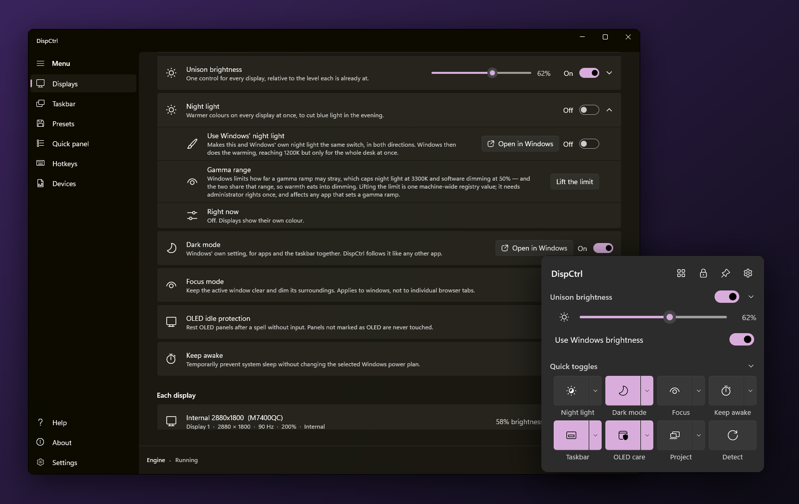

</div>

## Why DispCtrl

Windows treats a laptop panel and an external monitor as strangers. The
brightness keys move one of them. Night light has one strength for all of them.
The taskbar is on every screen or on none, and a monitor's own settings sit
behind five buttons on its underside.

DispCtrl runs as a small engine in the background and gives each display the
controls it should have had, plus a way to move them all together:

- **One brightness for the whole desk.** Each display has its own calibrated
  range, so the same level looks alike on an OLED laptop and an office monitor.
  Windows' own brightness slider and your laptop's keys can drive all of them.
- **The monitor's own menu, from your desk.** Contrast, input source, picture
  mode, volume: whatever the monitor offers over DDC/CI, and nothing it does not.
- **Scriptable to the last switch.** Every option in the app is also a
  `dispctrl` command with JSON output and proper exit codes.
- **Private by construction.** No network calls, no telemetry, no account.

> **Beta.** Everything below works and has been verified on real hardware, but
> on a single desk: a 2880x1800 OLED laptop at 200% beside a 1080p Dell at 100%.
> Monitors differ in what they answer over DDC/CI. A report from your desk is
> the most useful thing you can send; see [Contributing](#contributing).

## A quick tour

<div align="center">
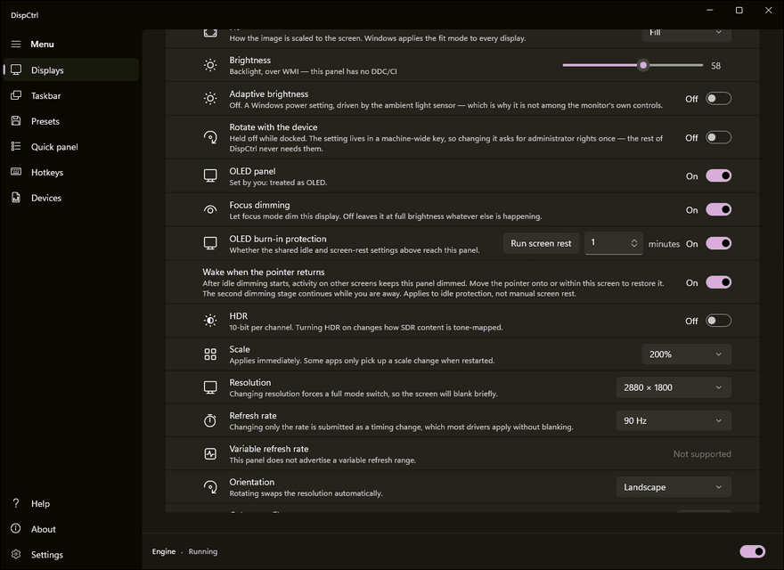
</div>

<table>
<tr>
<td width="42%" valign="top" align="center">
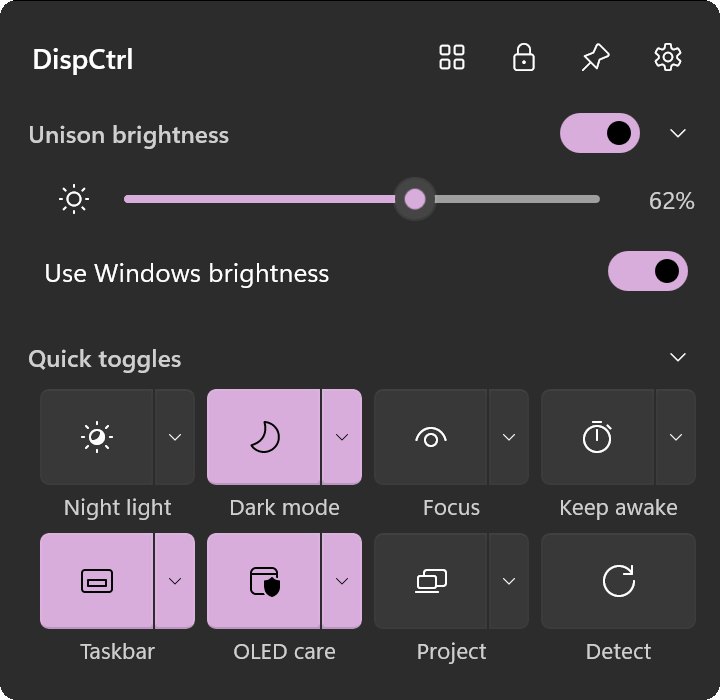
</td>
<td valign="top">

### The quick panel

Click the tray icon and it rises from the taskbar: one slider for every display,
a switch to hand Windows' own brightness keys to it, and toggles for night light,
dark mode, focus, keep-awake, the taskbar and OLED care. Each toggle's arrow
opens its options in place.

Below them, a row per display with its own brightness and switches. Sections
fold, reorder and hide. Tiles of your own run a `dispctrl` command or open a
program, script or link. A
simple mode keeps it to brightness alone.

### Brightness that agrees with itself

Calibrate once: capture the dimmest and brightest you want on each display, and
the unison slider runs every screen between its own limits. 40% then looks like
40% on an OLED laptop and on an office monitor alike.

</td>
</tr>
</table>

<div align="center">

</div>

## Features

<table>
<tr>
<td width="50%" valign="top">

### Brightness
- **Unison**: one slider for every display, each within its calibrated range
- **Replace Windows brightness**: Quick Settings and the brightness keys drive
  every display, not only the laptop
- Hardware brightness over DDC/CI and WMI
- Software dimming below each panel's minimum
- Monitors catch up when they are plugged back in

### Taskbar and desktop
- **Hide the taskbar per monitor**, and keep it on the others
- A different **wallpaper** on each display
- Display **arrangement at true physical size**: a 14" laptop looks smaller
  than a 24" monitor, whatever its resolution
- Identify and detect displays, and switch between extend, duplicate and
  single-screen modes

### Your monitor's own controls
- Everything it offers over **DDC/CI**: contrast, input, picture mode, volume,
  colour presets and more
- Only the values the monitor says it accepts. It never writes blind.
- A **device library** that learns manufacturer-specific codes, and lets you
  share what you find

</td>
<td width="50%" valign="top">

### Colour and comfort
- **Night light** per display or in unison, on a schedule or following Windows
- Warmer and dimmer than Windows allows (down to 1900K), once you choose to
  lift its gamma limit
- **Focus mode**: dims everything except the window you are working in
- **Keep awake** and **dark mode**, one click or one shortcut away

### OLED care
- Idle dimming in two stages, with fades
- Can be limited to OLED panels only
- Pauses for full-screen video and games
- Pairs with per-monitor taskbar hiding, so no static bar sits on the panel

### Automation
- **Quick panel** from the tray: tiles, sliders, per-display rows, a simple mode
- Global **hotkeys** that work with the window closed (21 actions)
- **`dispctrl.exe`**: every option, JSON in and out, `watch` for events
- **Presets** that follow the app in front (in development; see the
  [roadmap](#roadmap))

</td>
</tr>
</table>

## Install

Download from [**Releases**](https://github.com/jesvijonathan/Display-Control/releases).

| Package | File | What you get |
|---|---|---|
| **Installer** (recommended) | `...-setup.exe` | Per user, no administrator rights, starts at sign-in, clean uninstall |
| **Portable** | `...-desktop.zip` | Unzip anywhere and run `DispCtrl.App.exe` |
| **Command line** | `...-cli.zip` | `dispctrl.exe` and the engine, no window |
| **winget** | | Arrives with the first stable release: `winget install JesviJonathan.DispCtrl` |
| **Microsoft Store** | | Planned; the MSIX is already built with every release |

**Requirements:** Windows 11, x64. Everything is self-contained, so .NET does
not need to be installed.

Your settings live in `%LOCALAPPDATA%\DispCtrl` and carry over between versions,
and between the installer and the zips. Uninstalling stops the engine
gracefully, which puts back any taskbar it hid, and keeps your settings. Delete
that folder to remove them too.

<details>
<summary><b>"Windows protected your PC"?</b></summary>

Releases are not code-signed yet, so SmartScreen warns on first run. Choose
**More info > Run anyway**. To check that a download is the one that was
published, compare it with the checksums on the release page:

```powershell
Get-FileHash .\DispCtrl-0.1.0-stable-win-x64-setup.exe -Algorithm SHA256
```
</details>

## Getting started

1. Open **DispCtrl** from the Start menu. The engine starts with it and puts an
   icon in the notification area.
2. Click the tray icon for the **quick panel**: unison brightness, night light,
   and a row per display.
3. On the **Displays** page, under **Calibrated range**, capture the dimmest and
   the brightest level you want on each screen. From then on, one level means
   the same brightness everywhere.
4. Optionally, turn on **Replace Windows brightness**, so your brightness keys
   and the Quick Settings slider move every display.

Default shortcuts, all changeable on the Hotkeys page:

| Shortcut | Action |
|---|---|
| <kbd>Ctrl</kbd> + <kbd>Alt</kbd> + <kbd>PgUp</kbd> / <kbd>PgDn</kbd> | Every display brighter / dimmer |
| <kbd>Ctrl</kbd> + <kbd>Alt</kbd> + <kbd>N</kbd> | Night light |
| <kbd>Ctrl</kbd> + <kbd>Alt</kbd> + <kbd>F</kbd> | Focus mode |
| <kbd>Ctrl</kbd> + <kbd>Alt</kbd> + <kbd>K</kbd> | Keep awake |
| <kbd>Ctrl</kbd> + <kbd>Alt</kbd> + <kbd>I</kbd> | Identify displays |
| <kbd>Ctrl</kbd> + <kbd>Alt</kbd> + <kbd>D</kbd> | Quick panel |

## Command line

Everything the app can do, `dispctrl` can do, from a script, a scheduled task
or a macro key.

```powershell
dispctrl displays list                                        # what is attached, with stable ids
dispctrl unison set --level 40                                # every display, in step
dispctrl nightlight set --enabled on --from 20:00 --to 07:00
dispctrl display control --monitor 2 --name input-source --value hdmi-1
dispctrl display set --monitor 2 --controls "contrast=70"
dispctrl topology set --mode extend
dispctrl hotkeys add --keys "Ctrl+Alt+Home" --action unison-up --step 10
dispctrl watch --script .\on-display-change.ps1               # react to hotplug and changes
```

`--json` prints one line of machine-readable output. Exit codes: `0` done, `1`
refused or partial, `2` malformed request, `4` timed out. `dispctrl help` lists
everything. [docs/CLI.md](docs/CLI.md) is the reference, and
[examples/](examples) has scripts to start from.


<div align="center">
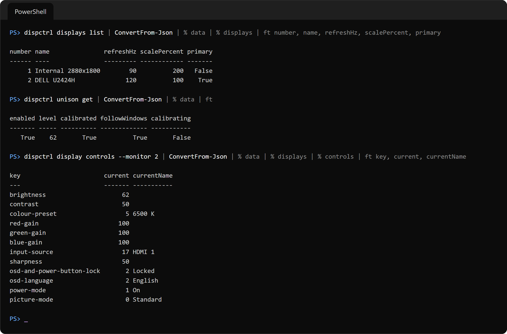
<br><sub>Real output from this desk. JSON in, JSON out, so PowerShell turns it straight into objects.</sub>
</div>

## Privacy

DispCtrl makes **no network calls**: no telemetry, no update check, no account,
no crash upload. Settings and logs stay in `%LOCALAPPDATA%\DispCtrl`.

The one thing that can leave your machine is a monitor report, and only when you
send it. **Displays > Monitor library** or `dispctrl contribute` builds a record
of the *model*: its EDID, modes and DDC/CI codes. Serial numbers, device paths,
file paths, your account name and your current settings are removed. You see
the exact text first. Sending it opens a prefilled GitHub issue in your own
browser, and you press Submit or you don't.

## Screenshots

<table>
<tr>
<td width="50%" valign="top">

**Displays**: unison, night light, focus, OLED care and keep-awake in one place
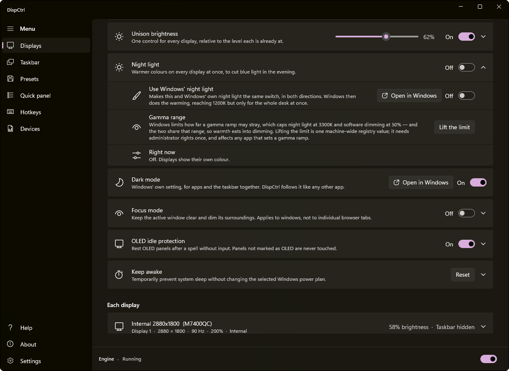

**Quick panel settings**: what the tray panel shows, and how


**Hotkeys**: global shortcuts the engine registers, 21 actions
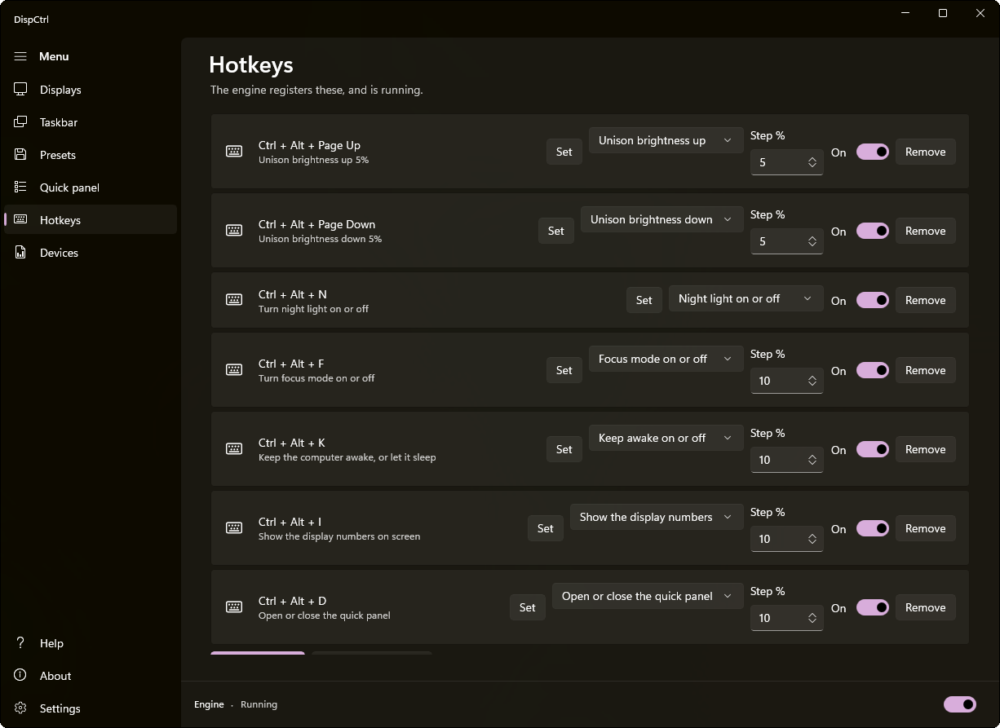

**Settings**: sign-in start, a preloaded panel, shortcuts
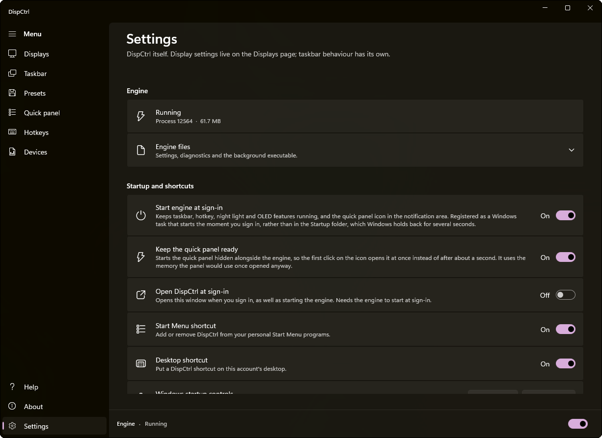

</td>
<td width="50%" valign="top">

**Each display**: brightness, OLED, HDR, scale, resolution and refresh
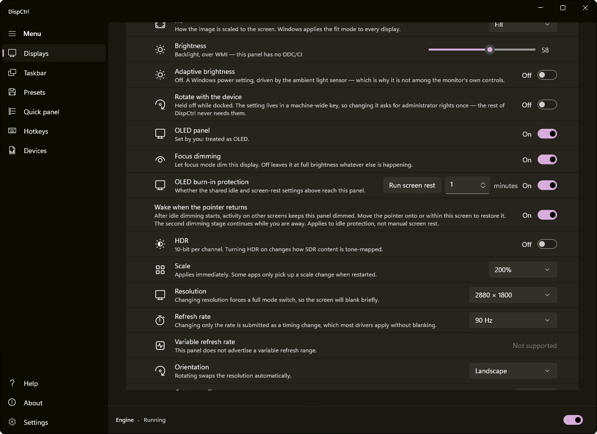

**Taskbar**: reveal delay, animation, edge sensitivity and polling
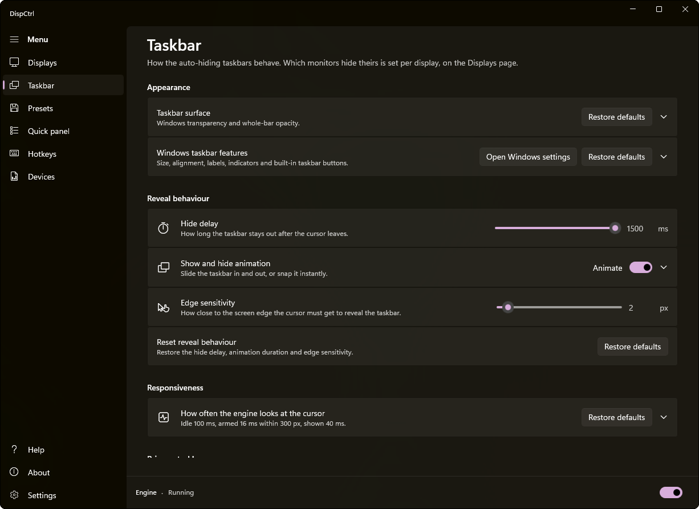

**Devices**: every monitor seen, and the codes nobody has named yet
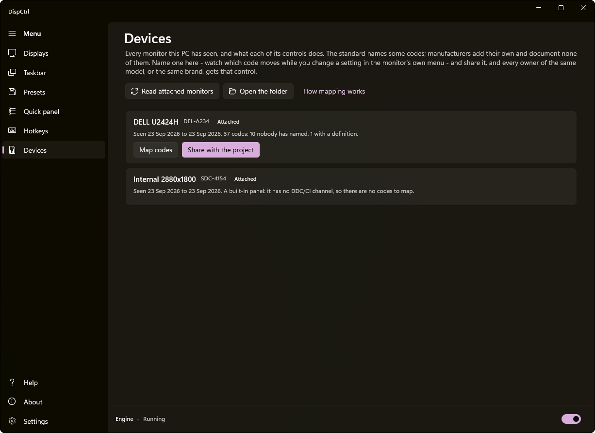

</td>
</tr>
</table>

## How it works

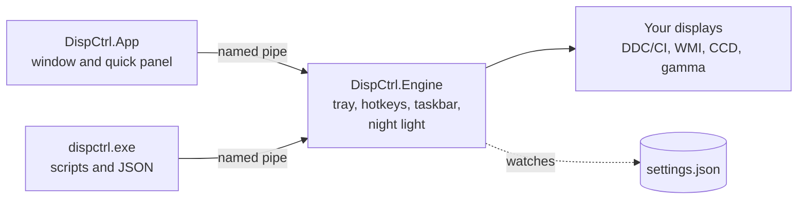

- **The engine** runs unelevated at sign-in. It owns the things that must
  outlive a window: the tray icon, global hotkeys, taskbar hiding and the
  gamma ramp.
- **The window, quick panel and CLI** are front ends. They send commands over
  a per-user named pipe, share `settings.json` with the engine, and fall back to
  running a command themselves when the engine is absent.
- **One DDC/CI conversation per monitor at a time,** across all three
  processes. Monitors answer only one caller, and a second looks like a dead
  monitor.

[CLAUDE.md](CLAUDE.md) is the full engineering handover, including the long list
of hardware traps the design works around.

## Hardware support

| Hardware | How DispCtrl talks to it | Tested |
|---|---|---|
| Built-in laptop panels | WMI brightness; night light and dimming through the gamma ramp | Samsung OLED in an ASUS Vivobook |
| External monitors over DisplayPort or HDMI | DDC/CI, which most monitors of the last decade support, sometimes behind a setting in their own menu | Dell U2424H |
| USB-C and Thunderbolt docks, MST hubs | DDC/CI when the dock passes it through | Not yet |
| DisplayLink adapters | Usually no DDC/CI: expect software dimming and night light only | Not yet |
| TVs | DDC/CI is rare | Not yet |

Has your monitor, dock or adapter worked, or not? That knowledge goes into the
[device library](devices/README.md), and every "not yet" above is one report away.

## Roadmap

- [x] Unison brightness with calibration, and Windows brightness integration
- [x] Per-display night light, dimming, taskbar hiding and wallpaper
- [x] DDC/CI controls, and a device library with sharing
- [x] Quick panel, hotkeys, and a full command line
- [x] Per-user installer, portable builds, and an MSIX
- [ ] Presets and per-app rules, out of beta
- [ ] Shade dimming: darker than the gamma ramp allows, with no Windows limit
- [ ] One brightness slider across hardware and software dimming
- [ ] Ambient light, from a sensor or a simulated one
- [ ] Brightness schedules and smooth transitions
- [ ] Microsoft Store and winget
- [ ] Arm64

[docs/FEATURES.md](docs/FEATURES.md) has each candidate with its effort, risk and
the prior art behind it. Ideas and votes are welcome in
[issues](https://github.com/jesvijonathan/Display-Control/issues).

## Build from source

Everything needed is checked, and the rest is fetched, by one script. On Windows,
in PowerShell:

```powershell
git clone https://github.com/jesvijonathan/Display-Control.git
cd Display-Control
.\build.cmd setup -Install   # checks the machine; offers to install .NET 10 and MinGW via winget
.\build.cmd build            # builds the CLI, engine and app; stops and restarts the engine for you
.\build.cmd test             # the hardware-free checks
.\build.cmd run app          # or: engine, panel, cli <arguments>
```

Or double-click `build.cmd` for a menu. That sequence is exactly what was run from
a clean copy to check these instructions: setup fetched what was missing,
the build succeeded with no warnings, every check passed, and `release` produced
the zips, installer and MSIX.

| You need | For | How `setup` handles it |
|---|---|---|
| Windows 11, x64 | the app and engine | checks |
| [.NET 10 SDK](https://dotnet.microsoft.com/download) | everything | installs it with `-Install` |
| MinGW-w64 `g++` | the taskbar-glass helper | installs it with `-Install`; or skip it with `-NoNative` |
| Windows SDK build tools | the MSIX | restores them from NuGet |
| Inno Setup | the installer | fetches a portable copy into `.tools/` |

On Linux, macOS or WSL, `./build.sh setup && ./build.sh build && ./build.sh test`
compiles everything except the window and runs the checks that need no Windows.

<details>
<summary><b>If something goes wrong</b></summary>

- **`build.cmd` is not recognised.** In PowerShell, run it as `.\build.cmd`.
  PowerShell does not run programs from the current folder by name.
- **MSB3027, a file is locked.** DispCtrl is running from this folder. Use
  `.\build.cmd build`, which stops it gracefully first. Do not end the engine in
  Task Manager: a killed engine leaves a hidden taskbar off-screen, and
  restarting Explorer brings it back.
- **No MinGW and no wish to install it.** Run `.\build.cmd options -NoNative`.
  The engine is then built without taskbar glass, and everything else is the
  same.
- **Scripts are blocked by execution policy.** `build.cmd` passes
  `-ExecutionPolicy Bypass` for its own script. Run `build/dev.ps1` through it,
  not directly.
</details>

[docs/DEVELOPING.md](docs/DEVELOPING.md) covers every command and option,
[docs/RELEASING.md](docs/RELEASING.md) covers releases, and
[CLAUDE.md](CLAUDE.md) is the engineering handover.

<details>
<summary><b>Repository layout</b></summary>

```
src/DispCtrl.Core      settings, EDID, presets, geometry - no hardware writes
src/DispCtrl.Display   everything that changes hardware: DDC/CI, CCD, gamma, wallpaper
src/DispCtrl.Engine    the resident process: tray, hotkeys, taskbar, night light, rules
src/DispCtrl.App       the WinUI 3 window and quick panel
src/DispCtrl.Cli       dispctrl.exe
src/DispCtrl.Control   the shared command API and the engine's named-pipe broker
native/                the taskbar-glass helper (C++, MinGW-w64)
devices/               the shared monitor library
tools/                 checks (controlcheck, presetcheck, devicecheck, ...)
build/, packaging/     developer script, publish, installer, MSIX
docs/                  CLI, developing, releasing, device library, roadmap
```
</details>

## Contributing

Contributions of every size are welcome.

- **Send your monitor.** In the app, go to **Displays > Monitor library**, or
  run `dispctrl contribute --open`. It takes a minute, and it is the fastest way
  to make DispCtrl work on hardware other than the author's.
- **Report a bug** with the
  [bug form](https://github.com/jesvijonathan/Display-Control/issues/new?template=bug.yml).
  Say which monitors and connections, because that is usually the answer.
- **Name a manufacturer code.** `dispctrl devices probe` watches what changes
  while you use the monitor's own menu. See
  [docs/DEVICE-LIBRARY.md](docs/DEVICE-LIBRARY.md).
- **Send code.** Start with [CONTRIBUTING.md](CONTRIBUTING.md) and
  [CLAUDE.md](CLAUDE.md). New features reach the command line first, then the
  app.

Please follow the [code of conduct](CODE_OF_CONDUCT.md). Report security issues
privately, as described in [SECURITY.md](SECURITY.md).

## Support the project

DispCtrl is free, open source, and built in spare time. If it earns a place on
your desk:

- **[Sponsor on GitHub](https://github.com/sponsors/jesvijonathan)**, monthly or
  once. It goes to development and to test hardware: every monitor, dock and
  panel type DispCtrl can be tested on is one more that works properly.
- **Star the repository.** It is how other people find it.
- **Send a monitor record.** It costs nothing, and it is worth as much as a
  donation.

## Acknowledgements

DispCtrl learned from the projects that came before it:
- [Twinkle Tray](https://github.com/xanderfrangos/twinkle-tray) and
  [Monitorian](https://github.com/emoacht/Monitorian) for brightness on Windows;
- [MonitorControl](https://github.com/MonitorControl/MonitorControl) for
  combined hardware and software dimming;
- [ColorControl](https://github.com/Maassoft/ColorControl) for GPU colour;
- [ddcutil](https://github.com/rockowitz/ddcutil), whose VCP feature table is the
  most complete public one.

It is built on [.NET](https://dotnet.microsoft.com/), the
[Windows App SDK](https://github.com/microsoft/WindowsAppSDK),
[CsWin32](https://github.com/microsoft/CsWin32) and the
[Windows Community Toolkit](https://github.com/CommunityToolkit/Windows).

## Licence

[MIT](LICENSE) © 2026 Jesvi Jonathan. Use it, change it, ship it.
