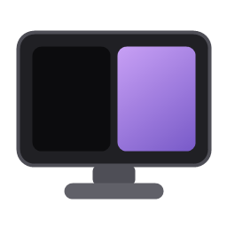
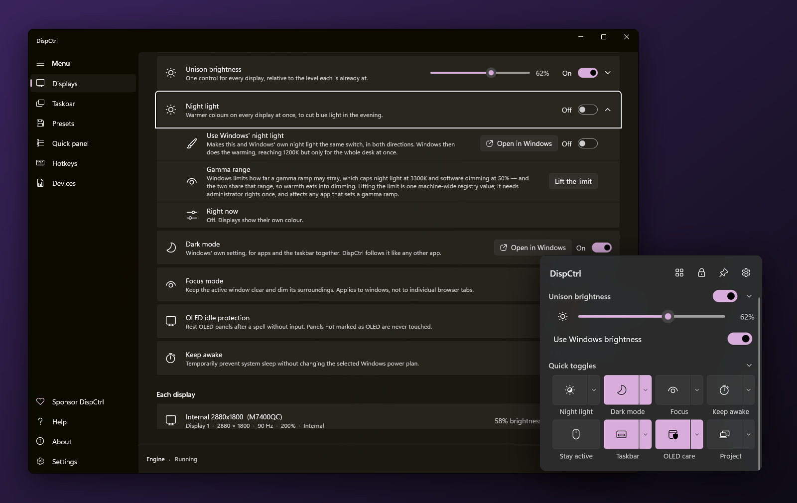
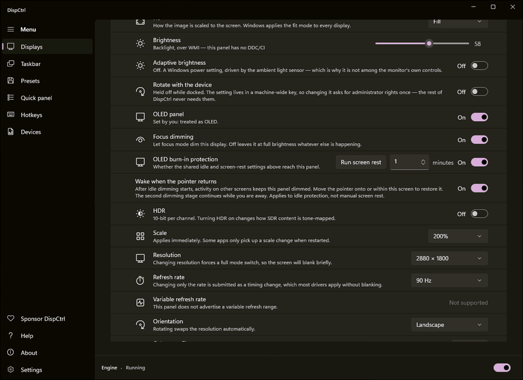
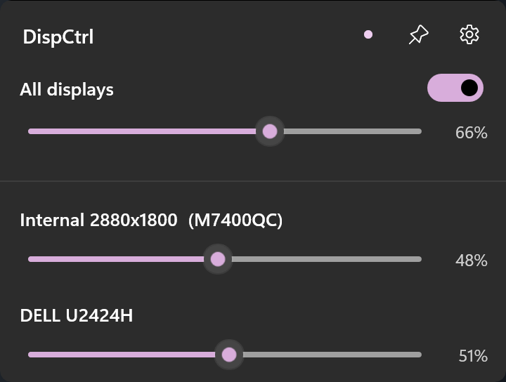
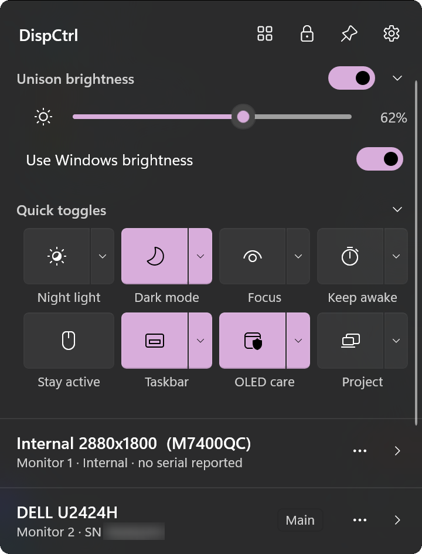
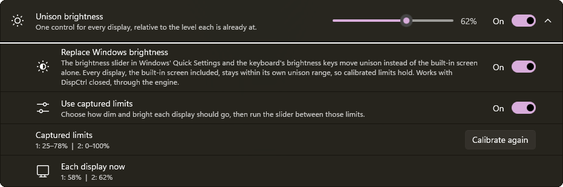
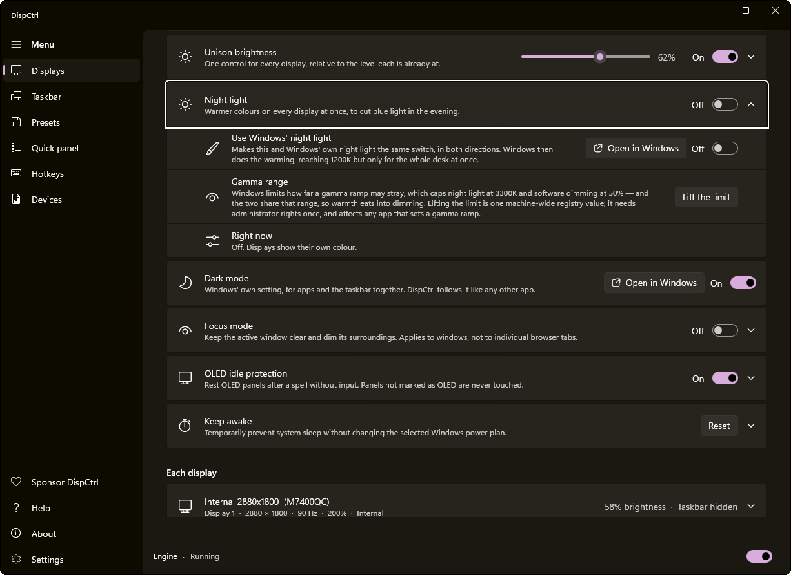
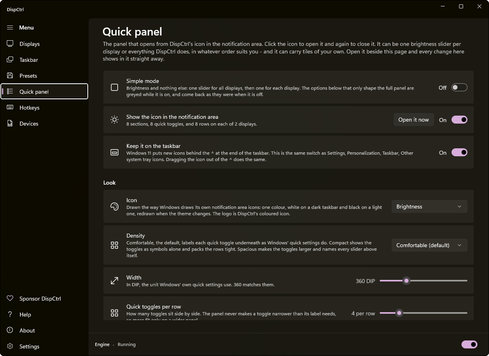
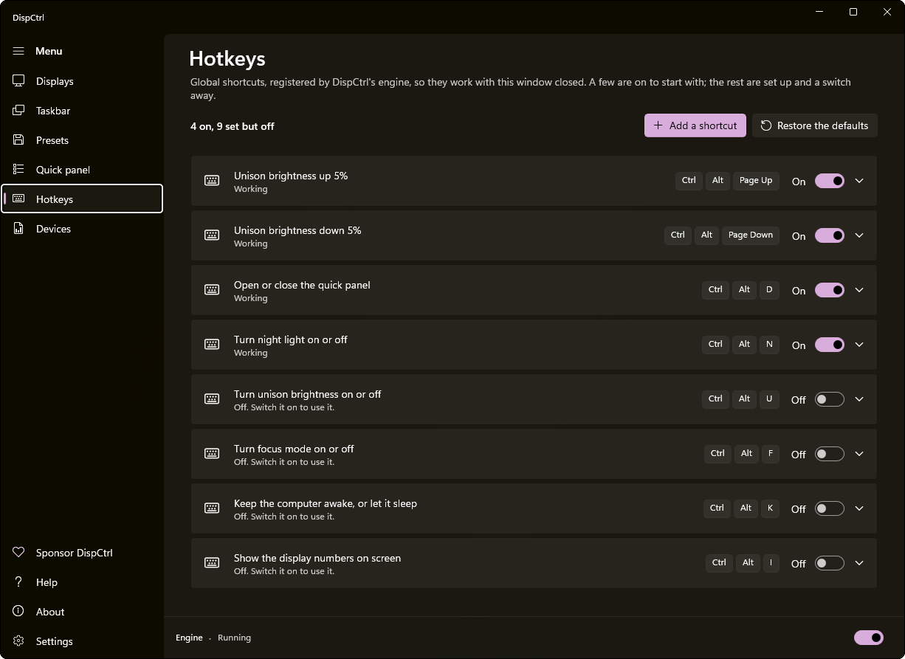
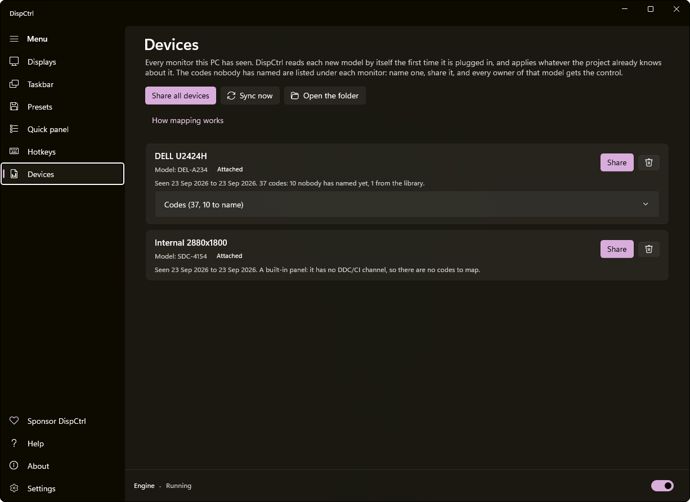

<div align="center">



# DispCtrl

**Every monitor on your desk, controlled as one.**

One place for brightness, night light, taskbars and OLED care across your desk.<br>
A native Windows app, a quick panel in your tray, and a scriptable command line.

[](devices/CATALOG.md) [](https://github.com/jesvijonathan/DispCtrl/stargazers) [](https://github.com/jesvijonathan/DispCtrl/releases) [](#install) [](LICENSE) [](https://github.com/sponsors/jesvijonathan)

[](https://apps.microsoft.com/detail/9PNQWKNRGVR0)&nbsp;
[](https://github.com/jesvijonathan/DispCtrl/releases/latest)

[Install](#install) · [Getting started](#getting-started) · [Documentation](#documentation) · [Website](https://jesvijonathan.github.io/DispCtrl/)

<br>



</div>

## Features

<table>
<tr>
<td width="50%" valign="top">

### Brightness

- **Unison**: one slider for every display, each within its own calibrated range
- **Replace Windows brightness**: let the laptop's brightness keys and Quick Settings move every display
- Hardware brightness over DDC/CI and WMI, software dimming below it

</td>
<td width="50%" valign="top">

### Colour and comfort

- Night light per display or in unison, scheduled or following Windows
- Warmth down to 1900K with the optional expanded gamma range
- Focus mode, keep-awake, Stay active and dark mode

</td>
</tr>
<tr>
<td width="50%" valign="top">

### Taskbar and desktop

- Hide taskbars independently on secondary monitors
- A wallpaper per display; arrangement drawn at true physical size
- Extend, duplicate and single-screen modes; identify and detect

</td>
<td width="50%" valign="top">

### OLED care

- Two-stage idle dimming, paused for full-screen video and games
- Knows OLED panels from the monitor or the device library; pairs with taskbar hiding

</td>
</tr>
<tr>
<td width="50%" valign="top">

### Your monitor's own controls

- Contrast, input, picture mode, volume and more, over DDC/CI
- Controls offered according to the monitor's capabilities
- A shared device library for named controls and panel information

</td>
<td width="50%" valign="top">

### Automation

- A quick panel on the tray icon: tiles, sliders, a row per display
- Global hotkeys that work with the window closed
- `dispctrl.exe`: every option, with JSON output

</td>
</tr>
</table>

<details>
<summary><b><ins>All features</ins></b>: every page, setting, option, shortcut and command, in full</summary>

<br>

Each part below opens on its own. Ranges and choices are the ones the app offers; defaults are a new install's.

<details>
<summary><b>Displays page</b></summary>

- **Arrangement**
  - Every display drawn at its real physical size, or **By resolution** as Windows draws it
  - Drag a display: it moves only between the positions Windows accepts, shown as dashed outlines, ranked by real distance
  - Identify (each display's number on it), Detect (find monitors that are connected but asleep), Reset, Apply
- **Multiple displays**: Extend these displays, Duplicate these displays, Show only on built-in display, Show only on external displays
- **Monitor library**: a link to the Devices page
- **Connect to a wireless display**: opens Windows' Miracast pairing
- **Unison brightness** (switch, slider down to the calibrated minimum)
  - Replace Windows brightness (switch): Quick Settings' slider and the brightness keys move every display
  - Use captured limits (switch)
  - Captured limits: Calibrate again (a walkthrough that drives each display to the end being captured; Cancel puts them back)
  - Each display now: every display's current level
  - Follow the room's light (switch, and a chevron that shows its options)
    - Light sensor (choice of the sensors found)
    - In the dark (slider 0-100)
    - In bright light (slider 0-100)
    - Calibrate the sensor: This is dark, This is bright, with the sensor's reading shown live
    - Learn from my adjustments (switch), Forget
- **Night light** (switch)
  - Use Windows' night light (switch), and a button to Windows' own page
  - Strength (slider 5-100)
  - Schedule (switch), Hours (from and to; a window past midnight is fine)
  - Gamma range: lift Windows' limit so warmth reaches 1900 K and dimming near black (asks for administrator once)
  - Right now: what is applied
- **Dark mode** (switch), and a button to Windows' colours page
- **Focus mode** (switch)
  - Background dimming (slider 0-100, steps of 5)
  - Delay after switching windows (0-10000 ms)
  - Fade duration (0-2000 ms)
  - Transition between windows: None, Fade the brightness, Slide the shape
  - One clear window per display, Keep the hovered window clear too, OLED displays only, Match the dimming to brightness, Follow the mouse, Follow new and activated windows, Dim other monitors, Keep taskbar area clear, Pause for fullscreen windows (switches)
  - Excluded apps (executable names)
  - Right now; Reset focus mode
- **OLED idle protection** (switch)
  - Which displays
  - Dim after inactivity (1-120 minutes)
  - Idle dimming (slider 0-100, steps of 5, previewed for two seconds)
  - Second-stage dimming (switch), Second stage after (1-120 minutes), Second-stage dimming level (from the first level to 100)
  - Idle fade duration (0-2000 ms)
  - Pause during fullscreen content (switch)
  - Reset OLED idle protection
- **Keep awake**
  - Turn off displays: Turn off now
    - Darkness (slider 50-100)
    - Turn the backlight down too (switch, from 90%)
    - Which displays: Every display, All but the main display, All but the one with the pointer, All but the active window's, Only the main display
    - Delay (0-30 seconds)
    - Wake only by the pointer, Hide the pointer, Lock when they wake (switches)
  - Stay active (switch)
  - Mode: Use the selected power plan, Keep awake indefinitely, Keep awake for a time interval, Keep awake until expiration
  - Time interval (0-168 hours, 0-59 minutes)
  - Expiration (date and time)
  - Keep displays on (switch)
  - Right now; Reset
- **Each display** (one card per display)
  - Wallpaper: Change; Fit: Fill, Fit, Stretch, Tile, Centre, Span
  - Brightness (0-100), or Software brightness where the display has no hardware control
  - Night light: this display's own warmth (5-100)
  - Adaptive brightness, Rotate with the device, OLED panel, Focus dimming (switches)
  - OLED burn-in protection (switch): Run screen rest, for 1-30 minutes
  - Wake when the pointer returns (switch)
  - Monitor sleep (switch, after 1-240 minutes): switch an external monitor off through its own power mode
  - HDR (switch), Scale, Resolution, Refresh rate, Variable refresh rate (switch)
  - Orientation: Landscape, Portrait, Landscape (flipped), Portrait (flipped)
  - Colour profile: Manage
  - Main display: Make this my main display
  - Hide the taskbar, Reclaim the work area (switches)
  - The monitor's own controls: Show controls, then a slider or a choice for each one it offers
  - Also reported: the monitor's read-only answers (firmware, hours in use and the like)
  - Reset this display

</details>

<details>
<summary><b>Taskbar page</b></summary>

- **Taskbar surface**: Restore defaults
  - Windows transparency (switch)
  - Aero glass blur (switch), Blur radius (0-100), Acrylic tint (0-100)
  - Taskbar opacity (0-100, steps of 5)
- **Windows taskbar features**: Open Windows settings, Restore defaults
  - Smaller taskbar buttons: Never, Always, When taskbar is full
  - Alignment: Left, Center
  - Combine buttons and hide labels, and Combine on other taskbars: Always, When taskbar is full, Never
  - Task View button, Widgets button, App badges, Flashing apps, Show desktop corner (switches)
- **Hide delay** (0-1500 ms, steps of 50)
- **Show and hide animation** (switch): Slide duration (40-500 ms)
- **Edge sensitivity** (1-20 px)
- **Reset reveal behaviour**
- **How often the engine looks at the cursor**: Arm distance (50-1000 px), Idle (20-400 ms), Far (100-2000 ms), Armed (8-100 ms), Shown (10-200 ms), Restore defaults
- **Use Windows' own auto-hide** (switch): the only way to hide the main display's taskbar
- Hiding the taskbar on each other display is on its card on the Displays page

</details>

<details>
<summary><b>Quick panel and tray icon</b></summary>

- **The panel**: rises from the taskbar and sinks back; closes when you click elsewhere unless pinned
- **Title bar**: the DispCtrl title drags it; buttons for simple mode (the dot), density, stay open (the pin) and customise
- **Simple mode**: one slider for all displays with the unison switch, then one slider per display
- **Sections**: Unison brightness, Quick toggles, Displays, Night light, Taskbar, Focus mode, OLED protection, Display mode (PC screen only, duplicate, extend, second screen only), Presets (coming soon); each can be folded
- **Quick toggles** (right-click one with an arrow for its options)
  - Night light: Strength, On a schedule, Warm each display separately, Follow Windows' night light
  - Dark mode
  - Focus: Dimming, Fade, transition (No transition, Fade the brightness, Slide the shape), One clear window per display, Keep the hovered window clear, Follow the mouse, Clear new windows first, OLED displays only, Scale with brightness, Dim other monitors, Keep the taskbar clear, Pause for fullscreen
  - Keep awake: Keep awake, Keep the displays on too, Stay active
  - Stay active
  - Taskbar: Glass, Glass tint, Corner rounding, Opacity, Transparency effects, Auto-hide the main taskbar
  - OLED care: Wait, Dim to, Dim further after longer, Then after, Down to, Pause during fullscreen
  - Project (Win+P modes), Displays off (Darkness, Which, Backlight down too, Wake only by the pointer, Hide the pointer, Lock when they wake), Detect, Unison (Use Windows brightness), Identify, Cast, Rest OLED, Engine
  - Your own tiles
- **Rows per display**: Brightness, Switches, Resolution, Scale, Refresh rate, Software dimming, Orientation, Monitor controls, Warmth, Input source
- **Switches per display**: Hide taskbar, HDR, Make main, Focus dimming, OLED care, Rest now, Monitor sleep, Variable refresh, Adaptive brightness, Auto-rotate, Identify (each only where the display supports it)
- **Quick panel page**
  - Simple mode, Show the icon in the notification area (and Open it now), Keep it on the taskbar
  - Icon: Brightness, Display, or DispCtrl's logo; Icon colour: the taskbar's white or black, or your accent colour; Show when active (bolder while Keep awake or Stay active is on)
  - Density: Compact, Comfortable, Spacious; Width; Quick toggles per row; Height: fit or fixed
  - Stay open when it loses focus, Lock its position, Link to all display settings, Animate opening and closing
  - Sections, Quick toggles, Each display, Switches on each display: drag to reorder, show or hide
  - Tiles you have made: run a `dispctrl` command, or open a program, script, document or address, with a name, a symbol and hover text
  - Hide chosen displays from the panel
  - Reset the quick panel
- **Tray icon**: drawn like Windows' own icons, white or black to match the taskbar, redrawn when the theme changes; kept on the taskbar the first time
- **Right-click menu**: Quick panel, Open DispCtrl, Simple view, Keep on the taskbar, Hide this icon, Stop the engine, Close the app, Exit DispCtrl

</details>

<details>
<summary><b>Hotkeys</b></summary>

- **Actions**: Unison brightness up, down, and on or off; Brightness up and down, one display; Night light on or off, warmer, cooler; Focus mode on or off; OLED care on or off; Rest the OLED displays now; Keep awake on or off; Stay active on or off; Turn the displays off, or back on; Put every display back (emergency); Dark or light mode; Hide or show the taskbar; Taskbar glass on or off; Contrast up and down; Next input source; Show the display numbers; Open or close the quick panel; Apply a preset (beta)
- **Per shortcut**: the keys, on or off, step (1-50%), display (0 for all, 1-8), preset
- **On by default**: Ctrl+Alt+Page Up and Page Down (unison, by 5), Ctrl+Alt+D (quick panel), Ctrl+Alt+N (night light), Ctrl+Alt+L (turn off displays), Ctrl+Alt+Backspace (put every display back)
- **Set up, switched off**: Ctrl+Alt+U (unison on or off), F (focus), K (keep awake), I (identify), M (dark mode), T (taskbar), O (OLED care), Ctrl+Alt+Shift+Page Up and Page Down (contrast)
- Never the arrow keys: some graphics drivers rotate the screen on Ctrl+Alt and an arrow, and the page says so
- Shows whether each shortcut is registered or taken by another program, and warns about combinations Windows keeps
- Asks before the emergency shortcut is switched off or removed; Restore the defaults at any time
- **Windows' own display shortcuts**, listed alongside: Win+P, Win+Shift+arrow, Win+Alt+B (HDR), Win+A (Quick Settings), Win+K (cast), Win+Ctrl+C (colour filters), Win+Ctrl+Shift+B (restart the graphics driver), and Open Windows' display settings

</details>

<details>
<summary><b>Devices page and the device library</b></summary>

- Every monitor this PC has seen, read by itself the first time it is plugged in: Sync now, Open the folder, How mapping works
- For each model: Codes (every code, standard, named by the library, or not yet named), Watch the unnamed codes live, Contribute, Remove from this list
- Name a code: What it does, Kind (range, choice, action, information), Maximum, Values it takes, Notes, Applies to (this model, the brand, every monitor), and "I have written it and seen what the monitor does - let DispCtrl write it"
- Say what a panel is (OLED, LCD, ...), built-in panels too
- Contribute my monitors: one prefilled GitHub issue with the record and the names, serials, device paths, file paths and your name removed; copied to the clipboard when too long for the link
- What the project already knows about a model is applied by itself

</details>

<details>
<summary><b>Presets (beta)</b></summary>

- Capture a setup: the whole desk or one display
- Saved setups: Apply, Update from displays, View / edit JSON, Map displays, Rename, Export JSON, Delete; Import JSON, Open folder
- Shows what has changed since a preset was saved
- App rules: executable name, preset, activation delay, Otherwise return to, Restore previous setup when leaving this app, Enabled, Remove rule, Add app rule

</details>

<details>
<summary><b>Settings, startup, engine, help and about</b></summary>

- **Startup**: Start engine at sign-in, Keep the quick panel ready, Open DispCtrl at sign-in, Start Menu shortcut, Desktop shortcut, Startup apps, Startup folder
- **Engine**: Settings file (Show in folder), Log (Open log), Executable, and the engine's state
- **Settings**: Write a log, Updates (Check for updates, by hand only), Repair, Clear logs and cached data, Undo the way back (Put back), Reset everything
- **Help**: Source code, Report a problem (a scrubbed report reviewed before a prefilled issue opens), Request a feature, Contribute code; fixes for a taskbar stuck off-screen, a main taskbar that will not hide, a monitor that forgot its settings
- **About**: purpose, the author, GitHub Sponsors, PayPal, UPI (with a QR code), version, runtime, Windows, components

</details>

<details>
<summary><b>Command line: <code>dispctrl</code></b></summary>

- `displays list`; `display get [--hardware]`, `modes`, `capabilities`, `controls`, `control --name KEY [--value V]`, `identify`, `factory-reset --confirm`, `reset [--factory --confirm]`
- `display set`: `--brightness --resolution --refresh --orientation --primary --x --y --scale --hdr --contrast --volume --sharpness --red-gain --green-gain --blue-gain --color-preset --input --power --wallpaper --vcp-code --vcp-value --controls`
- `gamma get|set --unlocked on|off`
- `devices list|show|scan|forget|probe|map|unmap|link|definitions|panel|contribute|validate`
- `settings get|schema|set|reset|export|validate|import`, with `--path` and `--monitor`
- `focus|oled|awake|nightlight|taskbar|tray get|set|reset`, with each setting as a flag (`--dim-percent 50 --enabled on`)
- `windows get|set` (taskbar preferences, VRR, dark mode, wallpaper fit), `windows open --page display|nightlight|colors|taskbar|startup|power|hdr|cast|colormanagement`
- `hotkeys list|add|set|remove|reset`; `unison get|set [--level] [--monitor --floor --ceiling]`; `ambient get|set|capture|forget|reset`
- `startup get|set --engine --preload-panel --open-window --start-menu --desktop`; `tray show`; `topology get|set --mode extend|duplicate|internal|external`
- `oled preview --percent`; `oled rest --monitor --minutes`; `awake displays-off --enabled on`; `restore now|undo|get`
- `engine start|stop|status`; `maintenance repair|clear-cache`
- `apply FILE [--dry-run]`; `watch [--events displays,settings,engine] [--interval] [--script]`; `scripts list|run`; `request FILE`
- `commands`, `status`, `diagnostics`, `report [--what --steps]`
- **Short commands**: `brightness [n|+n|-n]`, `dim`, `unison [on|off|n]`, `nightlight [on|off|n] --from --to --no-schedule`, `contrast`, `volume`, `sharpness`, `input NAME`, `power on|standby|off`, `vcp CODE [VALUE]`, `topology`, `resolution WxH`, `refresh HZ`, `primary`, `enable`/`disable` (taskbar hiding), `report`, `contribute [--open --quiet]`, with `--display n|token` or `--all`
- **Everywhere**: `--json`, `--text`, `--local`, `--dry-run`, `--monitor`, `--timeout`; tables in a terminal, JSON when piped; exit codes 0 done, 1 failed, 2 asked wrongly, 4 timed out, 130 cancelled; `DISPCTRL_DATA_DIR` for an isolated configuration
- Talks to the running engine through a named pipe, or does the work itself when the engine is not running

</details>

<details>
<summary><b>What happens without you</b></summary>

- The engine puts every hidden taskbar back when it stops, and even when it crashes
- A monitor plugged in is found within moments; one plugged back in is brought back in step with unison once it wakes
- A night light or dimming left behind by a crash is found and cleared at start
- The Windows brightness bridge follows the brightness keys smoothly while you hold them, and keeps the built-in panel inside its range
- Taskbar glass is re-applied when Explorer restarts or swaps the taskbar's brush
- OLED care stops watching while the PC is locked; the engine sleeps between checks, using about 16 ms of processor time a minute when idle
- The hidden quick panel gives its memory back ten seconds after closing
- Settings are saved atomically and merged between the app, the engine and the command line; a file being written is never read half-finished
- Only one DispCtrl window runs; opening it again brings the running one forward
- The installer stops the engine cleanly before updating, keeps your settings, and offers repair and a reset; uninstalling puts every taskbar back

</details>

<details>
<summary><b>Every stored setting, including those with no switch in the app</b></summary>

<br>

All of these live in `settings.json` and can be changed with `dispctrl settings set --path PATH --value VALUE`. `{monitor}` is a display's identity; `[]` is each item of a list.

| Setting | Default | Values | What it does |
|---|---|---|---|
| `/version` | 1 | number | Schema version, so a future format change can migrate rather than reset. |
| `/global/focus/enabled` | false | on or off | Focus mode on or off |
| `/global/focus/dimPercent` | 64 | number | How dark the background goes, 0 unchanged to 100 black |
| `/global/focus/delayMs` | 500 | number | Milliseconds after switching windows before the background dims |
| `/global/focus/fadeMs` | 300 | number | Milliseconds for the dimming to appear and disappear, and for the slide |
| `/global/focus/oledOnly` | false | on or off | Dim only panels marked as OLED |
| `/global/focus/easeBetweenWindows` | false | on or off | Slide the clear area across instead of cutting it at the new window. |
| `/global/focus/crossFadeWindows` | true | on or off | Fade the old cut-out out and the new one in when the window changes. |
| `/global/focus/scaleWithBrightness` | true | on or off | Ease the dimming on panels that unison brightness is already running dim. |
| `/global/focus/perMonitorFocus` | true | on or off | Give every display its own clear window rather than sharing one. |
| `/global/focus/keepHoveredClear` | true | on or off | Keep the window under the pointer clear as well as the focused one. |
| `/global/focus/followMouse` | true | on or off | Keep whatever the pointer is over clear, rather than the focused window. |
| `/global/focus/prioritizeNewWindows` | true | on or off | Temporarily prefer a newly shown or activated top-level window. |
| `/global/focus/dimOtherMonitors` | true | on or off | Also dim monitors without the active window |
| `/global/focus/pauseFullscreen` | true | on or off | Stop dimming while a full-screen window is in front |
| `/global/focus/keepTaskbarVisible` | false | on or off | Leave the taskbar area at normal brightness |
| `/global/focus/excludedApps` | "" | string | Executable names separated by commas, semicolons or newlines. |
| `/global/oledCare/enabled` | false | on or off | Dim automatically after IdleMinutes without input. |
| `/global/oledCare/idleMinutes` | 4 | number | Minutes without input before OLED panels dim |
| `/global/oledCare/dimPercent` | 60 | number | How far the first stage dims, 100 is black |
| `/global/oledCare/secondStageEnabled` | true | on or off | Dim again after a longer spell |
| `/global/oledCare/secondStageMinutes` | 12 | number | Further minutes before the second stage |
| `/global/oledCare/secondStageDimPercent` | 95 | number | How far the second stage dims; never lighter than the first |
| `/global/oledCare/fadeMs` | 2000 | number | Milliseconds to fade to the idle level |
| `/global/oledCare/pauseFullscreen` | true | on or off | No idle dimming while full-screen content plays |
| `/global/awake/mode` | "PowerPlan" | PowerPlan, Indefinite, Timed, Expiration | Keep awake: power plan (off), indefinitely, for an interval, or until a time |
| `/global/awake/keepDisplaysOn` | false | on or off | Also stop the displays timing out while keeping awake |
| `/global/awake/stayActive` | false | on or off | Keeps the screen on and the session looking attended, until switched off: no timer. See the engine's `PowerService`. |
| `/global/awake/displaysOffUtc` | none | string | When "Turn off displays" was asked for; null while the displays are on. |
| `/global/awake/displaysOffPercent` | 100 | number | How dark "off" is: 100 is black. |
| `/global/awake/displaysOffDelaySeconds` | 1 | number | Seconds between asking and the displays going dark. |
| `/global/awake/displaysOffTarget` | "All" | All, ExceptMain, ExceptPointer, ExceptActiveWindow, OnlyMain | Which displays Turn off displays blacks out |
| `/global/awake/displaysOffWakeOnPointer` | false | on or off | Wake a display only when the pointer moves on it, rather than on any input: a download or a render can be typed at, or a long read scrolled with the keys, without lighting every screen. |
| `/global/awake/displaysOffHidePointer` | true | on or off | Park the pointer in a corner of a display that went off, so no arrow floats on the black. |
| `/global/awake/displaysOffLockOnWake` | false | on or off | Lock the computer the moment the displays come back on. |
| `/global/awake/displaysOffBacklight` | false | on or off | Also turn each display's real backlight down, on those that allow it. |
| `/global/awake/intervalHours` | 1 | number | Hours, for keep awake for a time interval |
| `/global/awake/intervalMinutes` | 0 | number | Minutes, for keep awake for a time interval |
| `/global/awake/timedUntilUtc` | none | string | When the current interval ends |
| `/global/awake/expirationUtc` | none | string | Keep awake until this date and time |
| `/global/quickPanel/enabled` | true | on or off | Whether the icon is in the notification area at all. |
| `/global/quickPanel/icon` | "Brightness" | Brightness, Display, AppLogo | The icon in the notification area. |
| `/global/quickPanel/iconColour` | "Taskbar" | Taskbar, Accent | The glyph's colour: the taskbar's own white or black, or Windows' accent colour. |
| `/global/quickPanel/iconShowsActive` | true | on or off | Draws the glyph bolder while Stay active or Keep awake is on, so it can be seen at a glance. |
| `/global/quickPanel/density` | "Comfortable" | Compact, Comfortable, Spacious | Toggle size and labelling |
| `/global/quickPanel/width` | 360 | number | Panel width in DIP. |
| `/global/quickPanel/tileColumns` | 4 | number | How many toggles sit side by side in the grid. |
| `/global/quickPanel/fixedHeight` | true | on or off | Keep the panel one height and scroll inside it, rather than growing to fit. |
| `/global/quickPanel/height` | 500 | number | The height when FixedHeight is on, in DIP. |
| `/global/quickPanel/stayOpen` | false | on or off | Keep the panel open when it loses focus. |
| `/global/quickPanel/simple` | true | on or off | Brightness sliders only: all displays together, then one per display. |
| `/global/quickPanel/locked` | false | on or off | Keep the panel where it opens: its title is not a drag handle. |
| `/global/quickPanel/animate` | true | on or off | Animate the panel unless Windows has disabled animation effects. |
| `/global/quickPanel/showFooter` | false | on or off | The row that opens the full app, at the bottom. |
| `/global/quickPanel/customTiles` | empty | array | Tiles somebody made, run from the panel. See QuickPanelCustomTile. |
| `/global/quickPanel/customTiles[]/id` | none | string | Always starts with Prefix, so it can never collide with a built-in id. |
| `/global/quickPanel/customTiles[]/label` | none | string | The tile's name |
| `/global/quickPanel/customTiles[]/glyph` | none | string | A Segoe Fluent Icons code point, as a one-character string. |
| `/global/quickPanel/customTiles[]/kind` | none | Command, Program | Run a dispctrl command, or open a program, file or address |
| `/global/quickPanel/customTiles[]/target` | none | string | The `dispctrl` arguments, or the program, script, document or URL. |
| `/global/quickPanel/customTiles[]/arguments` | none | string | Arguments for a Program; unused for a command. |
| `/global/quickPanel/customTiles[]/hint` | none | string | Hover text |
| `/global/quickPanel/collapsed` | empty | array | Sections and displays folded away in the panel, by id - a section's id, or `display:` and a display's identity token. |
| `/global/quickPanel/expanded` | empty | array | Sections folded by default that somebody has opened. |
| `/global/quickPanel/sections` | list | array | The blocks of the full panel, in order, each shown or hidden |
| `/global/quickPanel/sections[]/id` | none | string | Which block |
| `/global/quickPanel/sections[]/visible` | none | on or off | Whether it shows |
| `/global/quickPanel/tiles` | list | array | The quick toggles, in order, each shown or hidden |
| `/global/quickPanel/displayRows` | list | array | The rows under each display's name, in order |
| `/global/quickPanel/displayTiles` | list | array | The switches in each display's block, in order |
| `/global/quickPanel/hiddenDisplays` | empty | array | Identity tokens of displays the panel leaves out. |
| `/global/taskbarOpacity` | 100 | number | Whole taskbar opacity, including icons. 100 leaves Explorer untouched. |
| `/global/taskbarGlassEnabled` | false | on or off | Use Explorer's compositor-backed XAML taskbar blur. |
| `/global/taskbarGlassRadius` | 48 | number | Gaussian blur radius in XAML/compositor pixels. |
| `/global/taskbarGlassTint` | 24 | number | Dark acrylic tint opacity applied after blur. |
| `/global/hideDelayMs` | 1500 | number | How long the bar stays out after the cursor leaves. |
| `/global/animMs` | 320 | number | Slide duration. 0 restores an instant snap. |
| `/global/revealPx` | 2 | number | How close to the screen edge the cursor must get to reveal. |
| `/global/armDistancePx` | 300 | number | Distance from a managed edge at which polling speeds up. |
| `/global/idlePollMs` | 100 | number | Poll interval when no managed edge is near the cursor. |
| `/global/farPollMs` | 500 | number | Longest the engine will ever wait between cursor checks. |
| `/global/armedPollMs` | 16 | number | Poll interval inside the armed band. |
| `/global/shownPollMs` | 40 | number | Poll interval while a bar is revealed. |
| `/global/logging` | false | on or off | Write a rolling log next to the settings file. |
| `/global/unisonBrightness` | true | on or off | Drive every display's brightness from one relative control. |
| `/global/unisonLevel` | 100 | number | The unison level, as a percentage of each display's own baseline. |
| `/global/unisonCalibrated` | false | on or off | Drive unison from a calibrated low/high limit per display instead of a multiplier on one captured level. |
| `/global/unisonFollowsWindows` | true | on or off | Let Windows' own brightness - the Quick Settings slider and the keyboard's brightness keys - drive the unison level. |
| `/global/preloadQuickPanel` | true | on or off | Start the quick panel hidden alongside the engine, so the first click opens it at once. |
| `/global/openWindowAtSignIn` | false | on or off | Open the DispCtrl window too when the engine starts at sign-in. |
| `/global/hotkeyDefaultsOffered` | false | on or off | Whether the default hotkeys have been added; see OfferDefaults. |
| `/global/hotkeyDefaultsVersion` | 0 | number | Which defaults version this desk has been offered; 0 before versions were counted. |
| `/global/trayPromotedFor` | empty | array | Engine locations whose tray icon was put on the taskbar once, by default. |
| `/global/engineStartupOffered` | false | on or off | Whether the Store package's sign-in task has been switched on once, by default. |
| `/global/beforeRestore/takenUtc` | none | string | When Ctrl+Alt+Backspace recorded it |
| `/global/beforeRestore/focus` | none | on or off | Whether focus mode was on |
| `/global/beforeRestore/oledCare` | none | on or off | Whether OLED care was on |
| `/global/beforeRestore/nightLight` | none | on or off | Whether night light was on |
| `/global/beforeRestore/taskbarOpacity` | none | number | The taskbar opacity it put back to 100 |
| `/global/beforeRestore/monitors` | none | object | Monitors that had taskbar hiding or software dimming on, by token. |
| `/global/beforeRestore/monitors/{monitor}/hideTaskbar` | none | on or off | Whether that monitor's taskbar was hidden |
| `/global/beforeRestore/monitors/{monitor}/softwareBrightness` | none | number | That monitor's software brightness |
| `/global/arrangeByResolution` | false | on or off | Draw the arrangement by pixel count, as Windows does, rather than by real size. |
| `/global/nightLight/enabled` | false | on or off | Warm the displays, subject to Scheduled. |
| `/global/nightLight/strength` | 5 | number | How warm, 0-100. See `NightLight.KelvinFor` for the range. |
| `/global/nightLight/unison` | true | on or off | Drive every display from Strength rather than each from its own. |
| `/global/nightLight/calibrated` | false | on or off | Run the unison slider between each display's captured warmth limits. |
| `/global/nightLight/followWindows` | false | on or off | Keep this toggle and Windows' own night light as one setting. |
| `/global/nightLight/scheduled` | false | on or off | Only warm between FromMinutes and ToMinutes. |
| `/global/nightLight/fromMinutes` | 1200 | number | Start of the warm period, in minutes past local midnight. |
| `/global/nightLight/toMinutes` | 420 | number | End of the warm period, in minutes past local midnight. |
| `/global/ambient/enabled` | false | on or off | Unison follows the room's light |
| `/global/ambient/sensorId` | "" | string | The sensor to follow; empty for the one Windows calls its default. |
| `/global/ambient/darkLevel` | 25 | number | Unison level in a dark room |
| `/global/ambient/brightLevel` | 100 | number | Unison level in bright light |
| `/global/ambient/darkLux` | 5 | number | The light at and below which unison sits at DarkLevel. |
| `/global/ambient/brightLux` | 800 | number | The light at which unison reaches BrightLevel: about a bright office. |
| `/global/ambient/learnCorrections` | true | on or off | Learn from the unison slider, hotkeys and brightness keys while following. |
| `/global/ambient/points` | empty | array | Levels chosen by hand in a given light, newest winning; see Learn. |
| `/global/ambient/points[]/lux` | none | number | The light it was learned in |
| `/global/ambient/points[]/level` | none | number | The level chosen there |
| `/monitors` | empty | object | Per-monitor settings keyed on `DisplayKey.ToToken()`. |
| `/monitors/{monitor}/label` | none | string | Last known friendly name. Purely so the settings file is readable — never used for matching, since names are not unique. |
| `/monitors/{monitor}/hideTaskbar` | none | on or off | Hide this monitor's taskbar, revealing it on cursor approach. |
| `/monitors/{monitor}/reclaimWorkArea` | none | on or off | Expand this monitor's work area to the full panel while its taskbar is managed. Revealing the bar overlays maximized windows without resizing them. |
| `/monitors/{monitor}/brightnessBaseline` | none | number | The brightness this display sits at when unison is at 100%. |
| `/monitors/{monitor}/brightnessFloor` | none | number | The dimmest level this display should reach when unison is calibrated. -1 means it has not been captured. |
| `/monitors/{monitor}/brightnessCeiling` | none | number | The brightest level this display should reach when unison is calibrated. -1 means it has not been captured. |
| `/monitors/{monitor}/nightLightStrength` | none | number | This display's own warmth, 0-100. -1 means it has not been set and the shared value applies. |
| `/monitors/{monitor}/nightLightFloor` | none | number | Least warmth this display should reach when unison is calibrated. |
| `/monitors/{monitor}/nightLightCeiling` | none | number | Most warmth this display should reach when unison is calibrated. |
| `/monitors/{monitor}/softwareBrightness` | none | number | Brightness for panels with no hardware control, 10-100. |
| `/monitors/{monitor}/isOled` | none | on or off | Whether this panel is OLED, and where that was decided. |
| `/monitors/{monitor}/oledDetected` | none | on or off | Last reported panel technology, so the engine never polls DDC for protection. |
| `/monitors/{monitor}/oledProtection` | none | on or off | Whether OLED idle care and screen rests reach this panel |
| `/monitors/{monitor}/alias` | none | string | Optional unique script-friendly monitor name. |
| `/monitors/{monitor}/oledWakeOnPointerReturn` | none | on or off | Keep an idle panel dimmed until the pointer moves on that panel. |
| `/monitors/{monitor}/oledRestMinutes` | none | number | Length of a screen rest run from this display |
| `/monitors/{monitor}/monitorSleepEnabled` | none | on or off | Turn this external monitor off through MCCS power mode after inactivity. |
| `/monitors/{monitor}/monitorSleepMinutes` | none | number | Idle minutes before monitor sleep |
| `/monitors/{monitor}/focusDimming` | none | on or off | Whether focus dimming touches this display at all. |
| `/monitors/{monitor}/oledRestUntilUtc` | none | string | Temporary screen-rest request consumed by the engine. |
| `/appRules` | empty | array | Rules that switch presets when an app takes the foreground. |
| `/appRules[]/process` | none | string | Executable name, with or without the extension. Case-insensitive. |
| `/appRules[]/preset` | none | string | The preset to apply while that app is in front. |
| `/appRules[]/enabled` | none | on or off | Whether this rule is live. |
| `/appRules[]/revertTo` | none | string | Preset to return to once the app is no longer in front. Blank leaves whatever the app's preset set in place. |
| `/appRules[]/restorePrevious` | none | on or off | Restore an in-memory snapshot when leaving this app. |
| `/appRules[]/dwellSeconds` | none | number | Seconds the app must remain foreground before switching. |
| `/hotkeys` | empty | array | Global keyboard shortcuts, registered by the engine. |
| `/hotkeys[]/key` | none | number | Win32 virtual-key code. |
| `/hotkeys[]/modifiers` | none | number | MOD_ALT 1, MOD_CONTROL 2, MOD_SHIFT 4, MOD_WIN 8. |
| `/hotkeys[]/action` | none | BrightnessUp, BrightnessDown, NightLightToggle, NightLigh... | What the shortcut does |
| `/hotkeys[]/display` | none | number | Which display, as the number shown in the panel. Zero means all. |
| `/hotkeys[]/preset` | none | string | Preset name, for ApplyPreset. |
| `/hotkeys[]/step` | none | number | How much a step changes, for the actions that step. |
| `/hotkeys[]/enabled` | none | on or off | Whether the shortcut is registered |

</details>

</details>

## Install

| Where | How |
|---|---|
| **Microsoft Store** | [**Get DispCtrl from the Microsoft Store**](https://apps.microsoft.com/detail/9PNQWKNRGVR0). Installs and updates itself. |
| **winget** | `winget install 9PNQWKNRGVR0 --source msstore` installs the Store version from a terminal. |
| **GitHub** | [**Download the latest release**](https://github.com/jesvijonathan/DispCtrl/releases/latest) and pick a file below. |

Every download is **Windows · x64 · self-contained**: no separate .NET installation needed. The [website](https://jesvijonathan.github.io/DispCtrl/#download) has the same options.

| Package | What you get |
|---|---|
| **`...-setup.exe`** (recommended) | Per-user install, no administrator rights. Starts at sign-in, adds a desktop shortcut and `dispctrl` to your `PATH`. Updates in place and keeps your settings; can reset or repair on the way. |
| `...-desktop.zip` | Portable: unzip anywhere and run `DispCtrl.App.exe` |
| `...-cli.zip` | `dispctrl.exe` and the engine, without the window |

Settings live in `%LOCALAPPDATA%\DispCtrl` (the Store version keeps them in its own folder, `%LOCALAPPDATA%\Packages\JustVStudio.DispCtrl_…\LocalCache\Local\DispCtrl`). Uninstalling stops the engine cleanly, puts back any taskbar it hid, and asks whether to keep your settings. Unsigned builds may trigger SmartScreen; each release has its SHA-256 checksums attached as `*SHA256SUMS.txt`.

## Getting started

1. Open **DispCtrl** from the Start menu. The engine starts with it and puts an icon on the taskbar.
2. Click that icon for the quick panel.
3. On the **Displays** page, under **Calibrated range**, capture each screen's dimmest and brightest level.
4. Turn on **Replace Windows brightness** to have the brightness keys move every display.

Default shortcuts (change them on the Hotkeys page, where more are set up and switched off):

| Shortcut | Action |
|---|---|
| <kbd>Ctrl</kbd> + <kbd>Alt</kbd> + <kbd>PgUp</kbd> / <kbd>PgDn</kbd> | Every display brighter / dimmer |
| <kbd>Ctrl</kbd> + <kbd>Alt</kbd> + <kbd>D</kbd> | Quick panel |
| <kbd>Ctrl</kbd> + <kbd>Alt</kbd> + <kbd>N</kbd> | Night light |
| <kbd>Ctrl</kbd> + <kbd>Alt</kbd> + <kbd>L</kbd> | Turn the displays off, or back on |
| <kbd>Ctrl</kbd> + <kbd>Alt</kbd> + <kbd>Backspace</kbd> | **Put every display back**: undoes dimming, night light, displays off and taskbar hiding |

> **A screen stuck black, dim or tinted?** Press <kbd>Ctrl</kbd> + <kbd>Alt</kbd> + <kbd>Backspace</kbd>. It undoes everything DispCtrl does to how a screen looks, and keeps your other settings. Once you can see again, **Settings > Undo the way back** (or `dispctrl restore undo`) switches back on what it turned off.

### Compatibility and feature status

| Feature | What to know |
|---|---|
| External monitor controls | Require DDC/CI support. Enable it in the monitor's own menu if needed; available controls depend on the monitor and connection. |
| Laptop brightness keys | **Replace Windows brightness** follows a supported built-in panel's brightness changes and applies them across your displays. |
| Primary taskbar | Uses Windows' global auto-hide. Independent hiding applies to secondary taskbars. |
| Extended warmth and dimming | The expanded gamma range needs a one-time administrator-approved change. |
| Presets | Saving, importing, applying and app-triggered presets are disabled in default builds. The Presets page can export the current configuration as JSON. |

## A quick tour

<div align="center">

</div>

<table>
<tr>
<td width="40%" align="center" valign="middle">

<br>
<sub>Simple mode, how it opens on a new install</sub>

<br>
<sub>The full panel, one click on the dot away</sub>

</td>
<td width="60%" valign="middle">

### The quick panel

Click the tray icon to bring your display controls within reach.

**Brightness and quick toggles**<br>
Adjust brightness, night light, dark mode, focus, keep-awake, taskbar hiding and OLED care. Each toggle's arrow opens its options.

**Control each display**<br>
Rows below the toggles give you individual monitor controls.

**Simple mode**<br>
New installs open with just brightness: one slider for every display together, and one for each. The dot in the title bar switches to the full panel and back.

**Make it yours**<br>
Fold, reorder or hide sections. Add custom tiles to run a `dispctrl` command or open a program.

</td>
</tr>
</table>

### Brightness that agrees with itself

Capture the dimmest and brightest you want on each display once, and the unison slider runs every screen between its own limits.



## Screenshots

[Explore the screenshot gallery on our website](https://jesvijonathan.github.io/DispCtrl/#tour).

<table>
<tr>
<td width="50%" valign="top">

**Displays**



</td>
<td width="50%" valign="top">

**Each display**


</td>
</tr>
<tr>
<td width="50%" valign="top">

**Quick panel settings**



</td>
<td width="50%" valign="top">

**Taskbar**


</td>
</tr>
<tr>
<td width="50%" valign="top">

**Hotkeys**



</td>
<td width="50%" valign="top">

**Devices**



</td>
</tr>
</table>

<details>
<summary><strong>View app settings</strong></summary>


</details>

## Command line

Everything the app does, `dispctrl` does, from a script, a scheduled task or a macro key.

```powershell
dispctrl displays list                                        # what is attached
dispctrl unison set --level 40                                # every display, in step
dispctrl nightlight set --enabled on --from 20:00 --to 07:00
dispctrl display control --monitor 2 --name input-source --value hdmi-1
dispctrl hotkeys add --keys "Ctrl+Alt+Home" --action unison-up --step 10
dispctrl maintenance repair                                   # fix the sign-in task and shortcuts
```

`--json` prints one line of machine-readable output; exit codes are `0` done, `1` refused, `2` malformed, `4` timed out. `dispctrl help` lists everything, [docs/CLI.md](docs/CLI.md) is the reference, and [docs/examples](docs/examples) has scripts to start from.

<div align="center">

</div>

## Privacy

DispCtrl's display controls run locally: **no telemetry, no automatic update checks, no account required**. Sharing a monitor record or problem report removes serial numbers, device paths and your account name, then opens a prefilled GitHub issue in your browser for you to review and submit.

Configuration exports and raw logs can contain identifying details; review them before sharing. See the [contribution guide](.github/CONTRIBUTING.md#reporting-a-bug) for report and log guidance.

## Documentation

| Guide | Contents |
|---|---|
| [Project website](https://jesvijonathan.github.io/DispCtrl/) | Features, screenshots, downloads and ways to support DispCtrl |
| [Command line](docs/CLI.md) | Commands, options, JSON output and exit codes |
| [Example scripts](docs/examples) | Display events, layouts and configuration files |
| [Quick panel](docs/QUICK-PANEL.md) | Sections, tiles and customisation |
| [Device library](docs/DEVICE-LIBRARY.md) | Monitor definitions, control mappings and contributions |
| [Development](docs/DEVELOPING.md) | Setup, builds, checks and platform requirements |
| [Releasing](docs/RELEASING.md) | Packaging and the release process |
| [Changelog](docs/CHANGELOG.md) | Changes and release history |

## Build from source

```powershell
git clone https://github.com/jesvijonathan/DispCtrl.git
cd DispCtrl
.\build.cmd setup -Install   # checks the machine; offers .NET 10 and MinGW through winget
.\build.cmd build            # builds; stops and restarts the engine for you
.\build.cmd test             # the hardware-free checks
.\build.cmd run app          # or: engine, panel, cli <arguments>
```

Double-click `build.cmd` for a menu. On Linux, macOS or WSL, `./build.sh` builds the non-UI projects and runs the checks that do not need Windows APIs; the application itself runs on Windows. [Development](docs/DEVELOPING.md) covers the options and prerequisites.

<details>
<summary><strong>Repository layout</strong></summary>

```
src/
  DispCtrl.App/        WinUI 3 window and quick panel
  DispCtrl.Engine/     resident process: tray, hotkeys, taskbar, night light
  DispCtrl.Cli/        dispctrl.exe
  DispCtrl.Control/    command API shared by all three, and the engine's pipe
  DispCtrl.Display/    everything that changes hardware: DDC/CI, CCD, gamma
  DispCtrl.Core/       settings, EDID, geometry; no hardware writes
  native/              taskbar-glass helper (C++)
devices/               the shared monitor library, a folder per model
tools/                 checks: controlcheck, presetcheck, devicecheck, ...
build/                 build, publish, installer and MSIX scripts
docs/                  CLI, developing, releasing, device library, changelog
site/                  the website (GitHub Pages) and every image the README uses
```

</details>

## Contributing

- **Send your monitor**: **Devices > Share** in the app, or `dispctrl devices contribute --monitor 2 --open`. It is the fastest way to make DispCtrl work on hardware other than the author's.
- **Report a problem**: **Help > Report a problem** in the app, or `dispctrl report --what "..."`, which gathers the diagnostics for you.
- **Send code**: see [CONTRIBUTING](.github/CONTRIBUTING.md).

Security issues go through [SECURITY](.github/SECURITY.md), not public issues.

## Support the project

<div align="center">

### Help build a better desk for everyone

DispCtrl is free and open source, built in spare time.<br>
Your support funds development and more monitors to test on.

[](https://github.com/sponsors/jesvijonathan)
[](https://paypal.me/jesvijon)
[](https://jesvijonathan.github.io/DispCtrl/#upi)

[Visit the support page](https://jesvijonathan.github.io/DispCtrl/#support)

**Every contribution helps.**<br>
[Star the repository](https://github.com/jesvijonathan/DispCtrl) · [Share your monitor](#contributing) · [Report a bug](https://github.com/jesvijonathan/DispCtrl/issues)

</div>

## Licence

[MIT](LICENSE) © 2026 [Jesvi Jonathan](https://www.jesvi.net) · [jesvi22j@gmail.com](mailto:jesvi22j@gmail.com) · [GitHub](https://github.com/jesvijonathan)
