<div align="center">

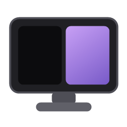

# DispCtrl - Display Control

**Every monitor on your desk, controlled as one.**

One place for brightness, night light, taskbars and OLED care across your desk.<br>
A native Windows app, a quick panel in your tray, and a scriptable command line.

[](devices/CATALOG.md) [](https://github.com/jesvijonathan/DispCtrl/stargazers) [](https://github.com/jesvijonathan/DispCtrl/releases) [](#install) [](LICENSE) [](https://github.com/sponsors/jesvijonathan)

[Install](#install) · [Getting started](#getting-started) · [Documentation](#documentation) · [Website](https://jesvijonathan.github.io/DispCtrl/)

<br>

<a href="https://apps.microsoft.com/detail/9PNQWKNRGVR0?mode=direct"></a>&nbsp;&nbsp;<a href="https://github.com/jesvijonathan/DispCtrl/releases/latest"></a>

<br>

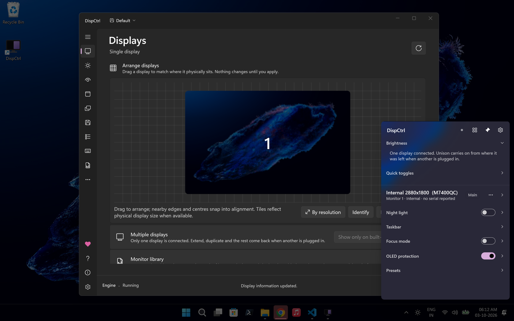

</div>

## Features

<table>
<tr>
<td width="50%" valign="top">

### Brightness

- **Unison**: one slider for every display, each within its own calibrated range
- **Replace Windows brightness**: let the laptop's brightness keys and Quick Settings move every display
- Hardware brightness over DDC/CI and WMI, software dimming below it
- Leave a display out of unison; turn the mouse wheel over the tray icon

</td>
<td width="50%" valign="top">

### Colour and comfort

- Night light per display or in unison, scheduled or following Windows
- Warmth down to 1900K with the optional expanded gamma range
- Focus mode, keep-awake, Stay active and dark mode, on night light's schedule if you like

</td>
</tr>
<tr>
<td width="50%" valign="top">

### Taskbar and desktop

- Hide taskbars independently on secondary monitors
- A wallpaper per display; arrangement drawn at true physical size
- Extend, duplicate and single-screen modes; identify and detect

</td>
<td width="50%" valign="top">

### OLED care

- Two-stage idle dimming, paused for full-screen video and games
- Rests each display on its own while you work on another, and keeps apps you watch awake
- Knows OLED panels from the monitor or the device library; pairs with taskbar hiding

</td>
</tr>
<tr>
<td width="50%" valign="top">

### Your monitor's own controls

- Contrast, input, picture mode, volume and more, over DDC/CI
- Controls offered according to the monitor's capabilities
- A shared device library for named controls and panel information

</td>
<td width="50%" valign="top">

### Automation

- A quick panel on the tray icon: tiles, sliders, a row per display
- Global hotkeys that work with the window closed
- `dispctrl.exe`: every option, with JSON output

</td>
</tr>
<tr>
<td width="50%" valign="top">

### Windows

- Pin any window on top, marked with a border and kept clear of focus dimming
- Gather every window onto one display, maximized and fullscreen ones included
- Put windows back when a monitor returns; open new windows where you work

</td>
<td width="50%" valign="top">

### Safety and updates

- Stops talking to a monitor whose capabilities read crashed Windows
- Settings that survive moving to a newer or an older version
- A daily check for new releases, one switch to turn off; the Microsoft Store updates itself

</td>
</tr>
</table>

**[Every feature, page by page](docs/FEATURES.md)** · [every setting](docs/SETTINGS.md) · [every command](docs/CLI.md)

## Install

| Where | How |
|---|---|
| **Microsoft Store** | [**Get DispCtrl from the Microsoft Store**](https://apps.microsoft.com/detail/9PNQWKNRGVR0). Installs and updates itself. |
| **winget** | `winget install 9PNQWKNRGVR0 --source msstore` |
| **GitHub** | [**The latest release**](https://github.com/jesvijonathan/DispCtrl/releases/latest), as one of the files below |

| File | Size | What you get |
|---|---|---|
| **`...-setup.exe`** (recommended) | ~30 MB | Installs for you alone, without administrator rights, or for everybody on the PC. Starts at sign-in, adds a desktop shortcut and `dispctrl` to your `PATH`, updates in place and keeps your settings. |
| `...-portable.zip` | ~46 MB | Unzip anywhere and run `DispCtrl.App.exe`. Nothing is installed. |
| `...-cli.zip` | ~19 MB | `dispctrl.exe` and the engine, without the window: for scripts and servers. |

Windows 11, x64. Every download carries its own trimmed copy of .NET and the Windows App SDK, so nothing else needs installing. Settings live in `%LOCALAPPDATA%\DispCtrl`. Uninstalling stops the engine cleanly, puts back any taskbar it hid, and asks whether to keep your settings. Each release lists its SHA-256 checksums in `SHA256SUMS.txt`; unsigned builds may meet SmartScreen.

## Getting started

1. Open **DispCtrl** from the Start menu. The engine starts with it and puts an icon in the notification area.
2. Click the icon for the quick panel: one brightness slider for every display, and one for each.
3. On the **Brightness** page, switch on **Use captured limits** and set each screen's dimmest and brightest level, so one slider moves them all evenly.
4. Switch on **Replace Windows brightness** and the laptop's brightness keys move every display.

| Shortcut | What it does |
|---|---|
| <kbd>Ctrl</kbd> <kbd>Alt</kbd> <kbd>PgUp</kbd> / <kbd>PgDn</kbd> | Every display brighter / dimmer |
| <kbd>Ctrl</kbd> <kbd>Alt</kbd> <kbd>D</kbd> | The quick panel |
| <kbd>Ctrl</kbd> <kbd>Alt</kbd> <kbd>N</kbd> | Night light |
| <kbd>Ctrl</kbd> <kbd>Alt</kbd> <kbd>L</kbd> | Turn the displays off, and back on |
| <kbd>Ctrl</kbd> <kbd>Alt</kbd> <kbd>P</kbd> / <kbd>G</kbd> | Pin the window in front on top / gather every window onto this display |
| <kbd>Ctrl</kbd> <kbd>Alt</kbd> <kbd>Backspace</kbd> | **Put every display back** |

> [!TIP]
> **A screen stuck black, dim or tinted?** <kbd>Ctrl</kbd> <kbd>Alt</kbd> <kbd>Backspace</kbd> switches off everything DispCtrl does to how a screen looks and keeps your other settings. **Settings › Undo the way back** switches it all on again.

More shortcuts are set up and switched off on the **Hotkeys** page.

## A tour

<div align="center">
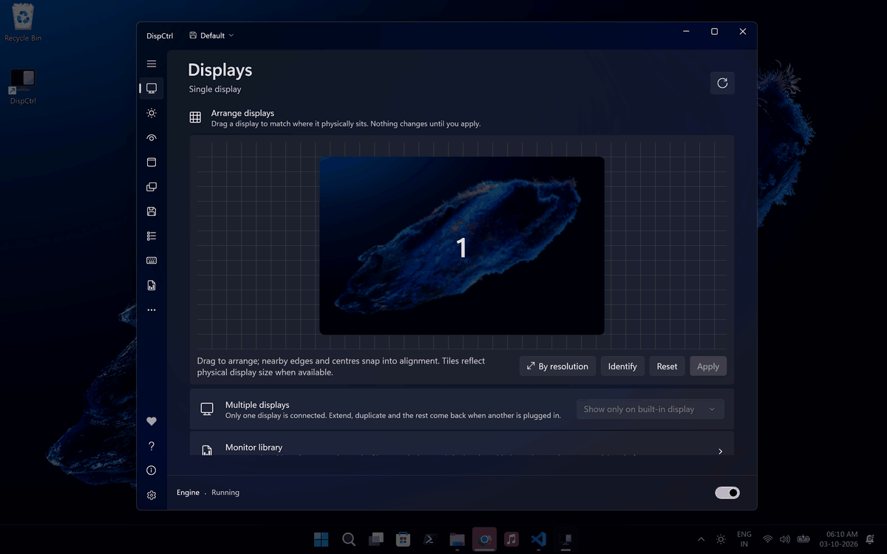
</div>

### The quick panel

Click the tray icon: brightness first, everything else a fold away. A new install opens in Simple mode; the dot in the title bar switches to the full panel.

<table>
<tr>
<td width="50%" align="center" valign="bottom">
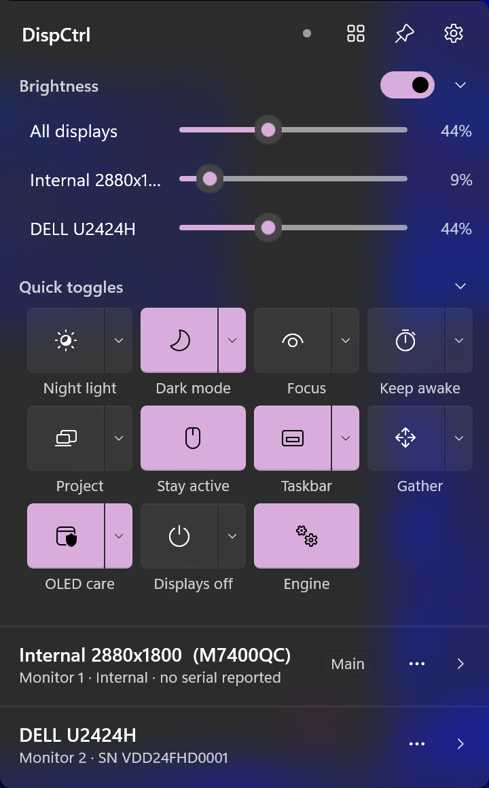<br>
<sub><b>The full panel</b></sub>
</td>
<td width="50%" align="center" valign="bottom">
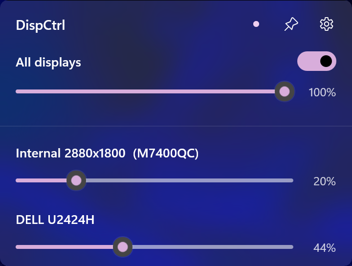<br>
<sub><b>Simple mode</b>, as a new install opens</sub>
</td>
</tr>
</table>

### The app

<table>
<tr>
<td width="50%" valign="top"><b>Displays</b>: the arrangement at real size<br><br>
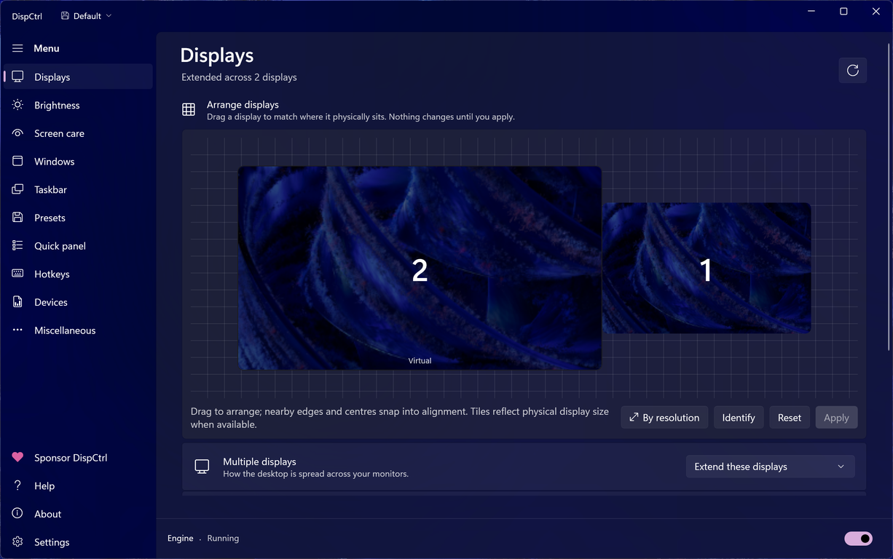</td>
<td width="50%" valign="top"><b>Brightness</b>: unison, room light, night light<br><br>
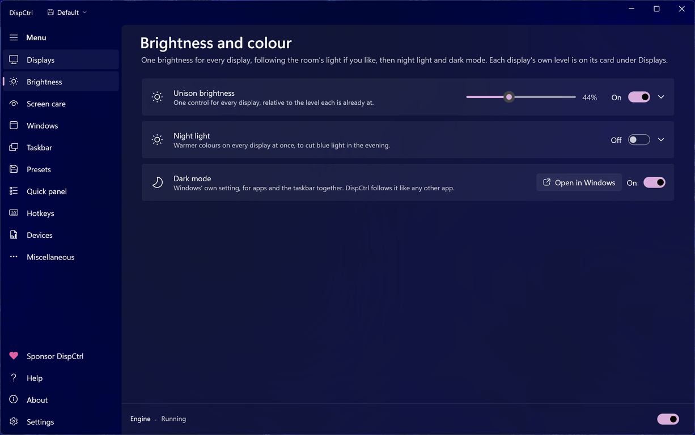</td>
</tr>
<tr>
<td width="50%" valign="top"><b>Screen care</b>: focus, OLED care, keep awake<br><br>
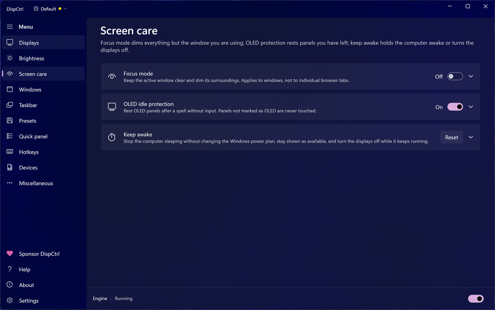</td>
<td width="50%" valign="top"><b>Presets</b>: a whole desk, saved<br><br>
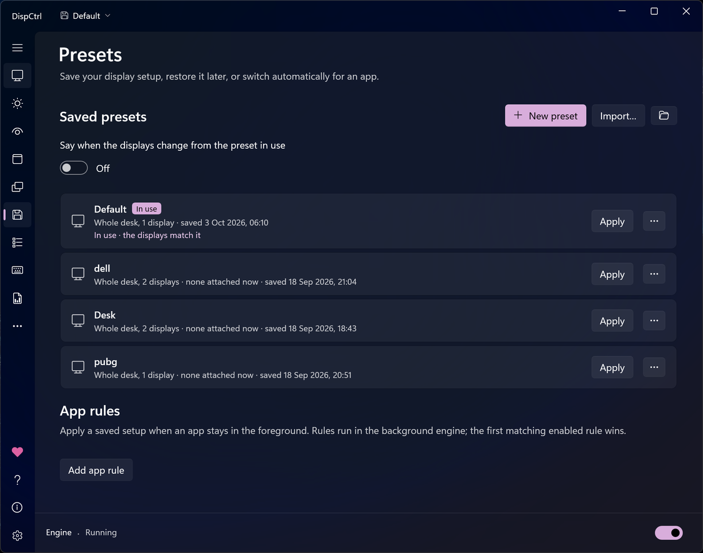</td>
</tr>
<tr>
<td width="50%" valign="top"><b>Hotkeys</b>: shortcuts, features, triggers<br><br>
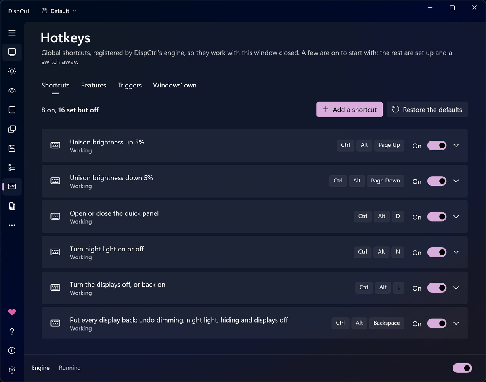</td>
<td width="50%" valign="top"><b>Taskbar</b>: hiding, glass, reveal timing<br><br>
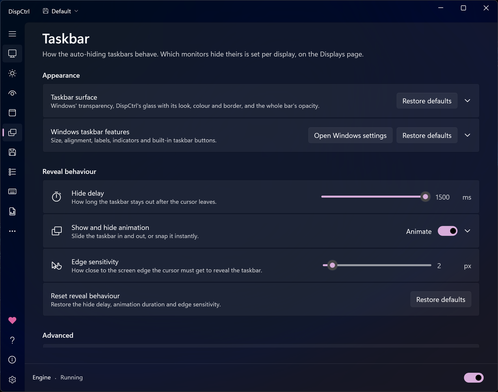</td>
</tr>
</table>

<details>
<summary><b>More screenshots</b>: devices, the quick panel's own settings, Settings</summary>

<br>

<table>
<tr>
<td width="50%" valign="top"><b>Devices</b>: each monitor's controls<br><br>
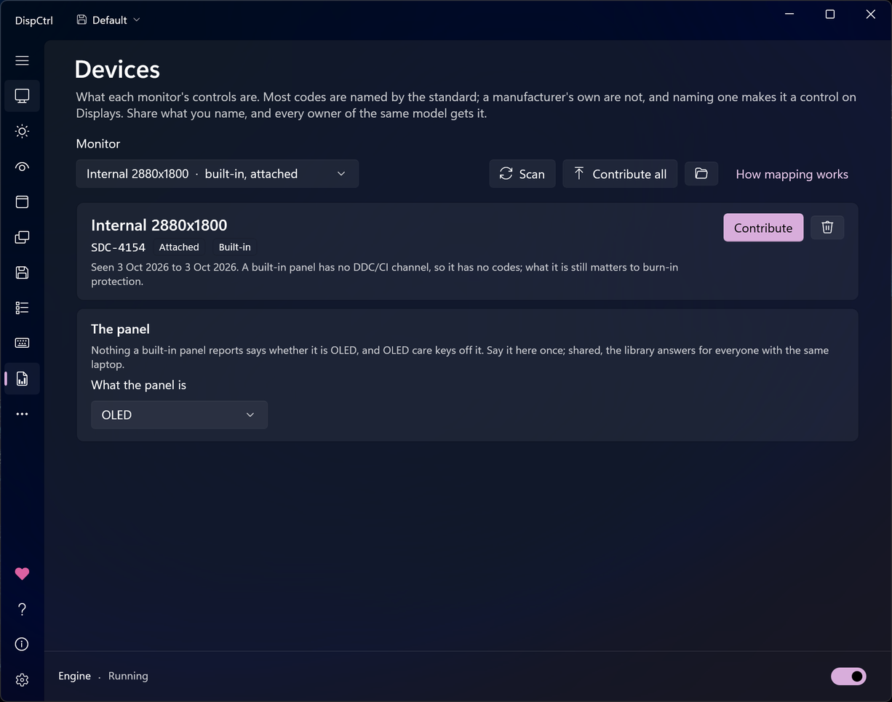</td>
<td width="50%" valign="top"><b>Quick panel</b>: what it shows and how<br><br>
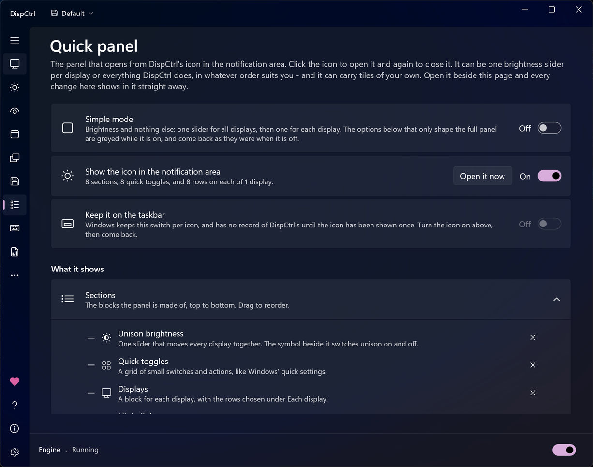</td>
</tr>
<tr>
<td width="50%" valign="top"><b>Settings</b>: engine, updates, maintenance<br><br>
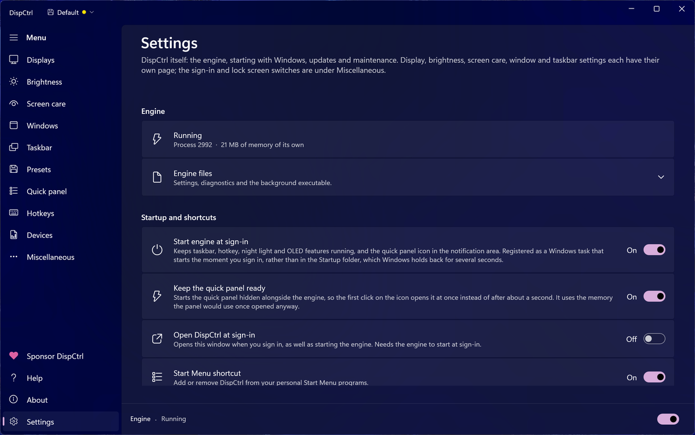</td>
<td width="50%" valign="top"></td>
</tr>
</table>

</details>

## Works with

| | |
|---|---|
| **External monitors** | Brightness, contrast, input, volume and the monitor's other controls over DDC/CI, offered only where the monitor says it has them. DDC/CI is sometimes off in the monitor's own menu. |
| **Laptop panels** | Brightness through Windows (WMI), and the brightness keys can drive every display. A panel with no hardware control gets software dimming. |
| **Docks, hubs and daisy chains** | Thunderbolt, USB-C and DisplayPort MST: each display behind them is its own display, with its own controls where DDC/CI gets through. |
| **Virtual and wireless displays** | Parsec, spacedesk and other virtual displays, USB display adapters and Miracast are recognised and named as such. They have no DDC/CI, so brightness there is software dimming where the driver allows it. |
| **Snap, FancyZones and other window tools** | Windows' Snap layouts are untouched. When PowerToys FancyZones is set to put new windows in their last zone, DispCtrl leaves new windows to it. |
| **Other brightness tools** | Twinkle Tray, Monitorian and DispCtrl can share a monitor: every DDC/CI conversation waits its turn, and a monitor whose capabilities read ever took Windows down is not read again until you allow it. |
| **The main taskbar** | Windows keeps it where it is: DispCtrl hides it through Windows' own auto-hide, and other taskbars independently. |

## Command line

Everything the app does, `dispctrl` does: from a script, a scheduled task, a stream deck or a macro key.

```powershell
dispctrl displays list                          # what is attached
dispctrl unison set --level 40                  # every display, in step
dispctrl nightlight set --enabled on --from 20:00 --to 07:00
dispctrl display control --monitor 2 --name input-source --value hdmi-1
dispctrl preset apply Evening
```

`dispctrl help` lists the topics and `dispctrl help TOPIC` shows one; `--json` gives one line of machine-readable output, and the exit code is `0` done, `1` refused, `2` asked wrongly. [The command line guide](docs/CLI.md) has everything, and [docs/examples](docs/examples) scripts to start from.

<div align="center">
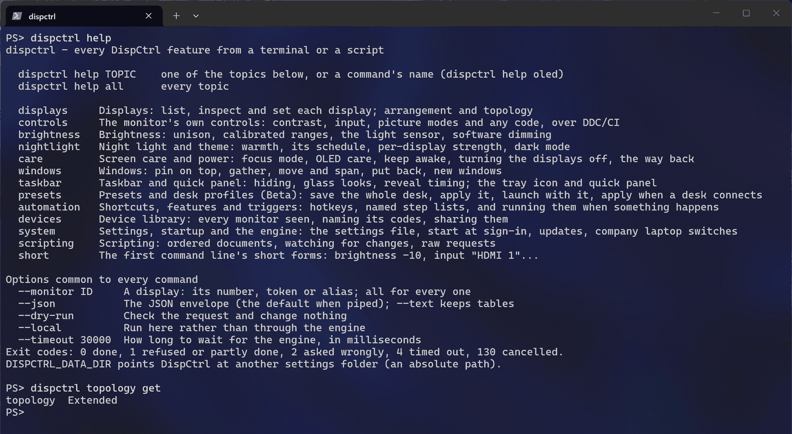
</div>

## Privacy

No telemetry and no account. The one request DispCtrl makes by itself is a daily check for a new release, which sends the version number and nothing else, never downloads, and is one switch to turn off in Settings (the Store version leaves updates to the Store). Sharing a monitor's record or a problem report removes serial numbers, device paths and your account name, then opens a prefilled GitHub issue for you to read before you submit it.

## Documentation

| | |
|---|---|
| [Features](docs/FEATURES.md) | Every page, option and shortcut, in the order the app shows them |
| [Settings reference](docs/SETTINGS.md) | Every stored setting, its default and what it does |
| [Command line](docs/CLI.md) | Commands, options, JSON output and exit codes |
| [Presets](docs/PRESETS.md), [custom controls](docs/CUSTOM-CONTROLS.md) | Desk profiles, app rules, mapped monitor controls and features |
| [Device library](docs/DEVICE-LIBRARY.md) | Monitor definitions and how to share yours |
| [For developers](docs/README.md#for-developers) | Architecture, building, testing, the traps already paid for, releasing |
| [Changelog](docs/CHANGELOG.md) | What changed in each release |

## Build from source

```powershell
git clone https://github.com/jesvijonathan/DispCtrl.git
cd DispCtrl
.\build.cmd setup -Install   # checks the machine; offers .NET 10 and MinGW through winget
.\build.cmd build            # builds, stopping and restarting the engine for you
.\build.cmd test             # the hardware-free checks
.\build.cmd run app          # or: engine, panel, cli <arguments>
```

On Linux, macOS or WSL, `./build.cmd setup`, `build` and `test` build everything except the window (WinUI needs Windows) and run the checks that need no Windows APIs; CI runs the same on Linux for every change. [Developing](docs/developer/DEVELOPING.md) has every option, and the [repository layout](docs/developer/ARCHITECTURE.md) where each part lives.

## Contributing

- **Share your monitor**: **Devices › Contribute** in the app, or `dispctrl devices contribute --monitor 2 --open`. It is the quickest way to make DispCtrl work on hardware the author does not have.
- **Report a problem**: **Help › Report a problem**, or `dispctrl report --what "..."`, which gathers the diagnostics for you.
- **Send code**: see [CONTRIBUTING](.github/CONTRIBUTING.md). Security issues go through [SECURITY](.github/SECURITY.md), not public issues.

## Support the project

DispCtrl is free and open source, made in spare time. A donation pays for development and for monitors to test on.

[](https://github.com/sponsors/jesvijonathan) [](https://paypal.me/jesvijon) [](https://jesvijonathan.github.io/DispCtrl/#upi)

Helping costs nothing, too: [star the repository](https://github.com/jesvijonathan/DispCtrl), [share your monitor](#contributing) or [report a bug](https://github.com/jesvijonathan/DispCtrl/issues). Every way to give, including a UPI QR code, is on the [support page](https://jesvijonathan.github.io/DispCtrl/#support).

## Licence

[MIT](LICENSE) © 2026 [Jesvi Jonathan](https://www.jesvi.net) · [jesvi22j@gmail.com](mailto:jesvi22j@gmail.com) · [GitHub](https://github.com/jesvijonathan)
